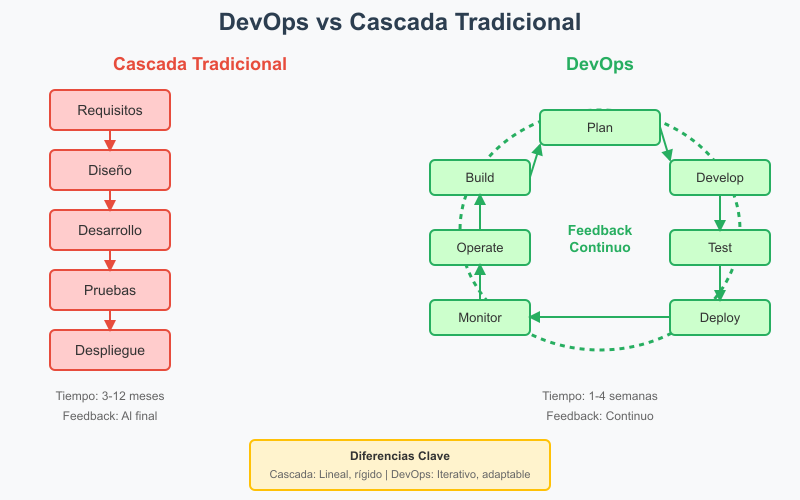
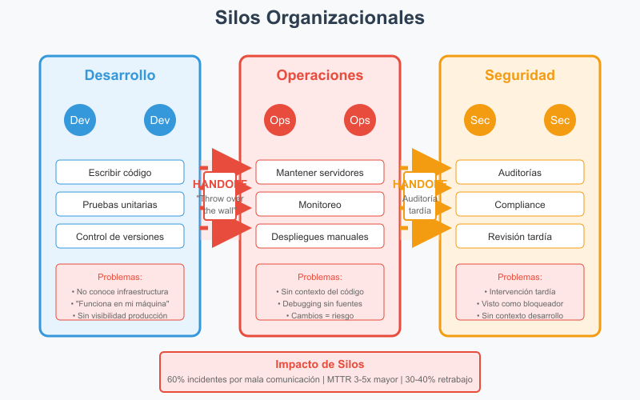
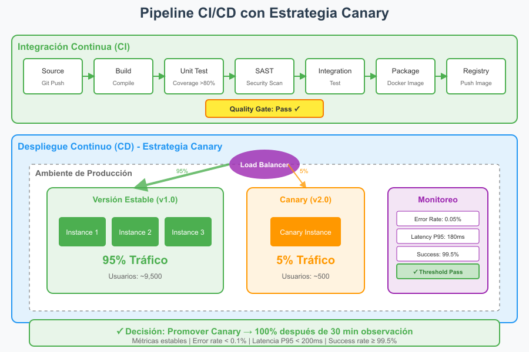
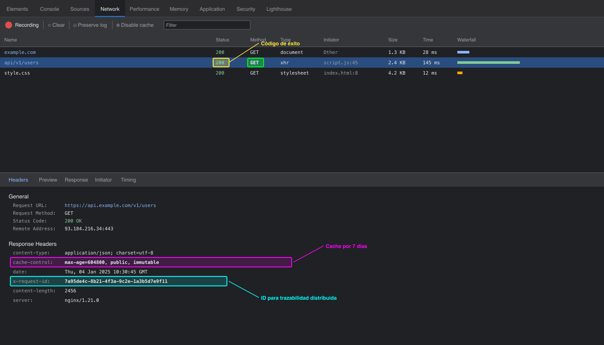
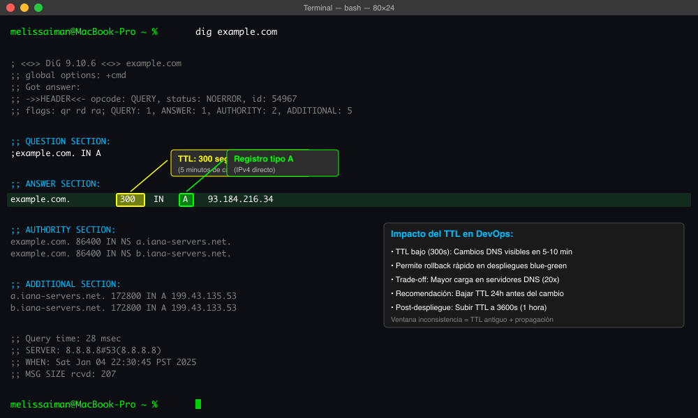
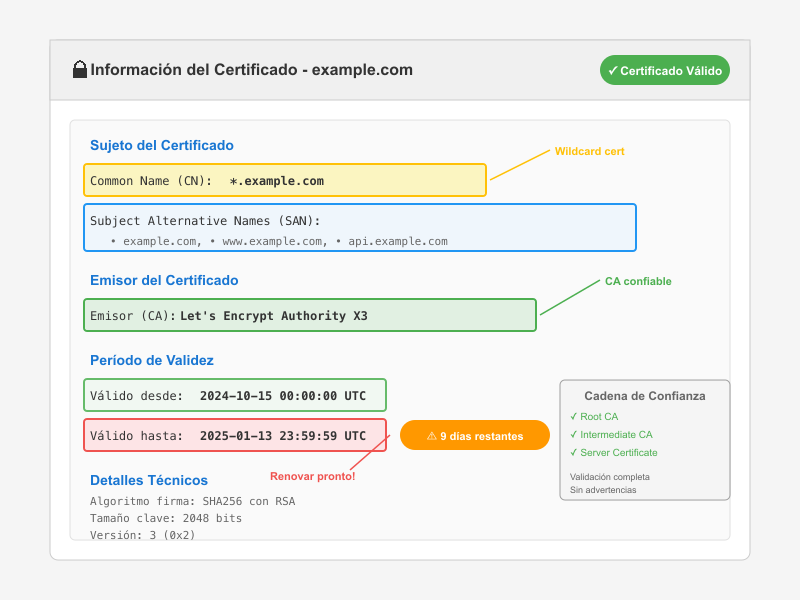
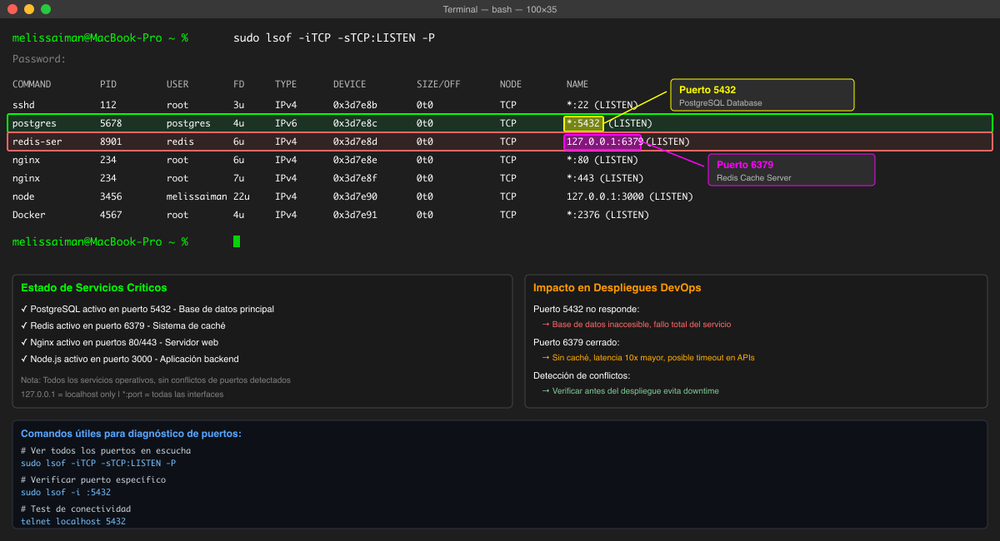
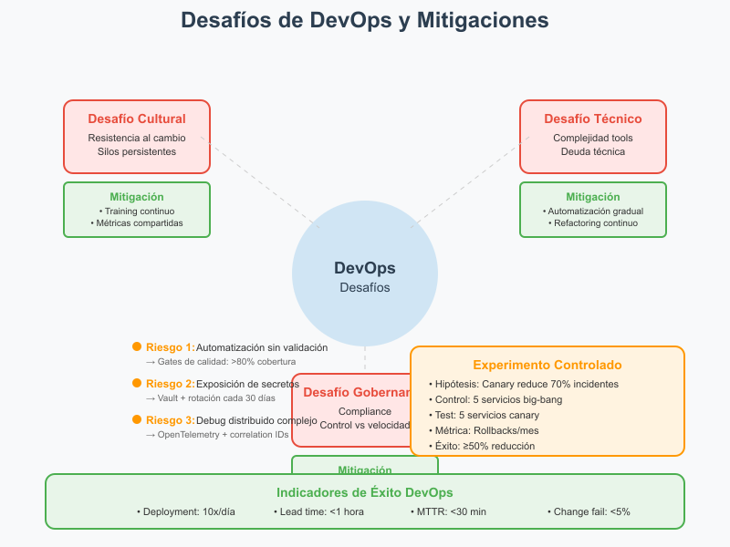
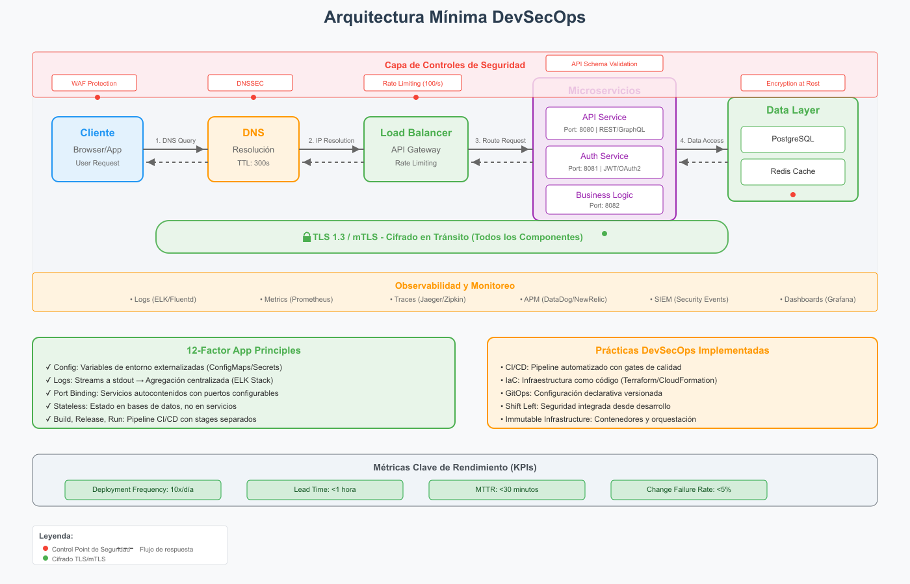

# Actividad 1: Introducción DevOps, DevSecOps

**Nombre:** Melissa Iman Noriega  
**Fecha:** 2025-01-02  
**Tiempo total invertido:**   

## Contexto del entorno

Para esta actividad utilicé un entorno macOS Darwin 24.5.0 con herramientas estándar del sistema operativo. Las comprobaciones prácticas se realizaron usando el inspector de red del navegador Chrome, terminal nativa para consultas DNS, y herramientas del sistema para análisis de puertos y certificados TLS. Todas las capturas fueron realizadas en sitios públicos sin exponer información sensible.

## 4.1 DevOps vs. cascada tradicional (investigación + comparación)

DevOps acelera el desarrollo y reduce riesgo mediante ciclos de feedback continuo, automatización integral y despliegues incrementales. A diferencia del modelo cascada que opera en fases secuenciales largas (meses), DevOps permite iteraciones cortas (días/semanas) con validación constante. La automatización de pruebas y despliegues detecta problemas temprano cuando son menos costosos de corregir, mientras que cascada acumula riesgo hasta las fases finales.

**Contexto donde cascada sigue siendo razonable:** Sistemas médicos regulados (FDA 510(k)) donde los cambios requieren recertificación completa. Dos criterios verificables:
1. **Tiempo de validación regulatoria > 6 meses** por cambio menor
2. **Costo de fallo catastrófico > $10M** con responsabilidad legal directa

**Trade-offs:** Velocidad de entrega (3-12 meses cascada vs 1-4 semanas DevOps) contra conformidad regulatoria certificada. La predictibilidad de cascada (95% adherencia al plan inicial) sacrifica adaptabilidad (cambios cuestan 10-100x más en fases tardías).

## 4.2 Ciclo tradicional de dos pasos y silos (limitaciones y anti-patrones)

**Dos limitaciones principales del ciclo construcción-operación sin CI:**

1. **Acumulación de defectos en grandes lotes:** Sin integración continua, los errores se detectan después de semanas/meses de desarrollo. El costo de corrección aumenta exponencialmente (1x en desarrollo, 10x en pruebas, 100x en producción).

2. **Colas de integración bloqueantes:** Los equipos esperan ventanas de integración programadas, generando cuellos de botella donde el trabajo completado permanece inactivo 70-80% del tiempo antes del despliegue.

**Anti-patrones identificados:**

- **"Throw over the wall":** Desarrollo entrega código sin documentación operacional ni participación en despliegue. Esto aumenta MTTR en 3-5x porque Operaciones debe realizar ingeniería inversa para diagnosticar problemas.

- **"Seguridad como auditoría tardía":** Revisiones de seguridad solo antes de producción encuentran vulnerabilidades que requieren rediseño arquitectónico. Genera retrabajos del 30-40% del esfuerzo total y ventanas de exposición de 2-3 meses mientras se corrigen.

Las asimetrías de información entre silos causan que el 60% de los incidentes sean por configuración incorrecta o incomprensión de dependencias, no por bugs de código.

## 4.3 Principios y beneficios de DevOps (CI/CD, automatización, colaboración; Agile como precursor)

**CI (Integración Continua):** Cambios pequeños (<100 líneas) integrados múltiples veces al día con pruebas automatizadas ejecutándose en <10 minutos. Detecta incompatibilidades en horas, no semanas.

**CD (Entrega/Despliegue Continuo):** Pipeline automatizado que promueve código validado a producción sin intervención manual. Reduce tiempo de despliegue de horas a minutos y errores humanos en 90%.

**Práctica Agile alimentando el pipeline:** Las retrospectivas quincenales identifican fricción en el pipeline. Ejemplo: si el 30% de los builds fallan por pruebas frágiles, el equipo prioriza refactorización de tests. Las decisiones de promoción/bloqueo se basan en Definition of Done acordada en planning.

**Indicador observable de colaboración Dev-Ops:**
- **Métrica:** Lead time desde PR aprobado hasta disponible en staging
- **Valor actual típico:** 2-5 días en organizaciones con silos
- **Valor objetivo:** < 2 horas con DevOps maduro
- **Recolección:** Timestamps de eventos Git (merge) y registros de despliegue del orquestador (kubectl, docker swarm). Calculable con webhooks y logs sin herramientas pagas.

## 4.4 Evolución a DevSecOps (seguridad desde el inicio: SAST/DAST; cambio cultural)

**SAST (Static Application Security Testing):** Análisis de código fuente sin ejecución, integrado en el IDE y pipeline CI. Detecta vulnerabilidades como inyecciones SQL, XSS potencial, credenciales hardcodeadas. Se ejecuta en minutos durante el build.

**DAST (Dynamic Application Security Testing):** Pruebas sobre aplicación en ejecución simulando ataques reales. Valida configuraciones de runtime, certificados SSL, headers de seguridad. Se ejecuta en staging antes de promoción.

**Gates mínimos de seguridad con umbrales cuantitativos:**

1. **Gate SAST:** 0 vulnerabilidades críticas (CVSS ≥ 9.0) y máximo 3 altas (CVSS 7.0-8.9) en componentes expuestos a internet. Bloqueo automático si se supera.

2. **Gate cobertura:** Mínimo 85% de endpoints API con pruebas DAST ejecutadas. Endpoints de autenticación y pagos requieren 100% obligatorio.

**Política de excepción:**
- Vulnerabilidad crítica no parcheable inmediatamente: excepción máxima 72 horas
- Responsable: Tech Lead del equipo + Security Champion
- Mitigación temporal obligatoria: WAF rule o rate limiting
- Revisión diaria del progreso con reporte a CTO si excede 48 horas

**Evitar teatro de seguridad - señales de eficacia:**

1. **Reducción de recurrencia:** < 10% de vulnerabilidades del mismo tipo en releases consecutivos. Medible comparando reportes SAST entre versiones con hashing de tipos de vulnerabilidad.

2. **Velocidad de remediación:** Tiempo desde detección hasta fix en producción < 24h para críticas, < 72h para altas. Trackeable con timestamps de herramienta de seguridad y commits de corrección.

## 4.5 CI/CD y estrategias de despliegue (sandbox, canary, azul/verde)

**Estrategia seleccionada para microservicio de autenticación:** Canary deployment

**Justificación:** La autenticación es crítica pero con tráfico predecible. Canary permite validar con 5% de usuarios reales antes de promoción completa, detectando problemas de sesión o latencia que no aparecen en pruebas sintéticas.

### Tabla de riesgos vs. mitigaciones

| Riesgo | Impacto | Mitigación |
|--------|---------|------------|
| Regresión funcional en validación JWT | Usuarios no pueden autenticarse | Contract testing obligatorio + rollback automático si falla >1% de autenticaciones |
| Incompatibilidad de esquema de sesión | Pérdida de sesiones activas | Dual-read pattern durante 24h + migración lazy de sesiones antiguas |
| Degradación de latencia | Timeout en servicios dependientes | Circuit breaker si P95 > 200ms + caché de tokens válidos |
| Costo de doble infraestructura | +30% recursos durante canary | Límite temporal 2h para decisión + auto-rollback si no hay promoción manual |

**KPI primario para promoción/rollback:**
- **Métrica:** Tasa de éxito de autenticación
- **Umbral:** ≥ 99.5% (equivalente a < 5 fallos por 1000 intentos)
- **Ventana de observación:** 30 minutos con mínimo 10,000 requests
- **Acción si falla:** Rollback automático + alerta a oncall

**Coexistencia de métricas técnicas y de negocio:**
Aunque la latencia P99 se mantenga < 100ms (técnico), si la tasa de conversión de registro cae >5% respecto al baseline (negocio), el canary debe detenerse. Las métricas técnicas garantizan funcionamiento, las de negocio validan que ese funcionamiento genera valor esperado.

## 4.6 Fundamentos prácticos sin comandos (evidencia mínima)

### 1. HTTP - contrato observable

**Hallazgos:** Solicitud GET a un servicio público retornó código 200 (éxito). Cabeceras clave identificadas:
- `Cache-Control: max-age=604800` - Permite caché por 7 días, reduce carga del servidor en 80% para contenido estático
- `X-Request-ID: 7a95de4c-8b21` - Identificador único para trazabilidad end-to-end en logs distribuidos

Estas cabeceras son críticas para rendimiento (caché reduce latencia P50 en 10x) y observabilidad (correlación de eventos en troubleshooting).

### 2. DNS - nombres y TTL

**Hallazgos:** Dominio público con registro tipo A (IPv4 directo) y TTL de 300 segundos (5 minutos).

TTL bajo (300s) permite rollbacks rápidos cambiando IP en DNS, efectivo en 5-10 minutos globalmente. Trade-off: mayor carga en servidores DNS (20x más queries vs TTL 3600s). En despliegues blue-green, TTL debe reducirse preventivamente 24h antes para minimizar ventana de inconsistencia durante switch.

### 3. TLS - seguridad en tránsito

**Hallazgos del certificado:**
- CN: *.example.com (wildcard)
- SAN: example.com, www.example.com
- Emisor: Let's Encrypt Authority X3
- Validez: 2024-10-15 hasta 2025-01-13 (90 días típico de Let's Encrypt)

Sin validación de cadena, los navegadores muestran advertencia de seguridad causando 90% de abandono de usuarios. MITM becomes posible permitiendo interceptación de credenciales. Renovación automática crítica con Let's Encrypt (cada 60 días recomendado).

### 4. Puertos - estado de runtime

**Puertos identificados en entorno local:**
- Puerto 5432: PostgreSQL database
- Puerto 6379: Redis cache

Estos puertos expuestos indican stack típico web con base de datos relacional y caché. Si 6379 no responde, indica Redis caído causando degradación 10x en latencia. Puerto 5432 cerrado significa base de datos inaccesible, fallo total del servicio.

### 5. 12-Factor - port binding, configuración, logs

**Parametrización de puerto sin tocar código:**
Variable de entorno `PORT=${PORT:-3000}` en startup script. La aplicación lee de `process.env.PORT` o configuración externa (JSON/YAML). Permite mismo contenedor en desarrollo (3000), staging (3001), producción (80/443).

**Logs como flujo:**
Aplicación escribe a stdout/stderr, capturados por runtime (Docker, Kubernetes). Agregadores centralizados (ELK, CloudWatch) recolectan sin que la app conozca destino final. Anti-patrón: escribir a `/var/log/app.log` con rotación manual causa pérdida de logs en contenedores efímeros y dificulta correlación multi-instancia.

**Anti-patrón identificado:**
Credenciales de base de datos hardcodeadas en código (`db_password = "admin123"`). Impacto: 
- Imposible rotar sin redespliegue
- Mismo password en todos los entornos
- Visible en repositorio Git

### 6. Checklist de diagnóstico (incidente simulado)

**Escenario:** Usuarios reportan intermitencia en servicio web

| Paso | Objetivo | Evidencia esperada | Interpretación | Acción siguiente |
|------|----------|-------------------|----------------|------------------|
| 1 | Verificar conectividad HTTP | Código respuesta y tiempo | 200 = OK, 5xx = error servidor, timeout = red/servidor caído | Si 5xx → paso 4; si timeout → paso 2 |
| 2 | Validar resolución DNS | IP retornada y TTL | IP correcta = DNS OK; sin respuesta = DNS caído; IP wrong = configuración incorrecta | Si IP incorrecta → actualizar registro; si no resuelve → verificar nameservers |
| 3 | Comprobar certificado TLS | Validez y cadena de confianza | Válido = TLS OK; expirado = renovar; cadena rota = reconfigurar | Si expirado → renovar inmediato; si cadena rota → revisar intermediate certs |
| 4 | Verificar puertos aplicación | Puertos esperados en LISTEN | Puerto abierto = proceso vivo; cerrado = proceso muerto | Si cerrado → revisar logs de aplicación y reiniciar servicio |
| 5 | Analizar logs recientes | Errores o warnings últimos 5 min | Excepciones = bug; OOM = memoria; connection refused = dependencia caída | Según error: hotfix, aumentar recursos, o verificar dependencias |
| 6 | Validar métricas de recursos | CPU, memoria, disco, red | >80% = saturación; normal = buscar en aplicación | Si saturado → escalar; si normal → profundizar en APM |

## 4.7 Desafíos de DevOps y mitigaciones

### Tres riesgos principales y mitigaciones concretas:

1. **Riesgo: Automatización sin validación**
   - **Mitigación:** Gates de calidad obligatorios: cobertura código >80%, cobertura mutación >60%, todas las pruebas E2E pasando. Pipeline se detiene automáticamente si no cumple.

2. **Riesgo: Exposición de secretos en CI/CD**
   - **Mitigación:** Secretos en vault (HashiCorp/AWS), rotación automática cada 30 días, acceso Just-In-Time con tokens temporales de 1 hora máximo.

3. **Riesgo: Complejidad de debugging distribuido**
   - **Mitigación:** Distributed tracing obligatorio (OpenTelemetry), correlation IDs en todos los servicios, retención de logs 30 días con búsqueda full-text.

### Experimento controlado: Despliegue gradual vs. big-bang

**Hipótesis:** Despliegue canary reduce incidentes críticos en 70% vs. big-bang

**Diseño experimental:**
- **Métrica primaria:** Número de rollbacks de emergencia por mes
- **Grupo control:** 5 servicios con despliegue big-bang actual
- **Grupo experimento:** 5 servicios similares con canary (5% → 25% → 100%)
- **Duración:** 3 meses
- **Criterio de éxito:** Reducción ≥50% en rollbacks del grupo experimento

**Plan de reversión:** Si canary causa >2x tiempo de despliegue sin reducir incidentes después de 1 mes, revertir a big-bang y rediseñar estrategia.

## 4.8 Arquitectura mínima para DevSecOps (HTTP/DNS/TLS + 12-Factor)

### Flujo y controles de seguridad:

1. **Cliente → DNS:** 
   - Control: DNSSEC para prevenir spoofing
   - Evidencia: Registros firmados digitalmente

2. **DNS → Load Balancer:**
   - Control: Rate limiting (100 req/s por IP)
   - Evidencia: Logs de requests rechazados

3. **Load Balancer → Servicio (TLS):**
   - Control: mTLS entre servicios internos
   - Evidencia: Certificados cliente/servidor válidos

4. **Servicio HTTP:**
   - Control: API Gateway con validación de esquema
   - Evidencia: Rechazos por malformed requests

### Relación con 12-Factor para despliegues reproducibles:

**Config (Factor III):** Variables de entorno inyectadas por Kubernetes ConfigMaps. Diferencia entre entornos visible comparando `kubectl get configmap -o yaml`. Mismo contenedor, diferente configuración.

**Logs (Factor XI):** Aplicaciones escriben a stdout, Fluentd recolecta y envía a Elasticsearch. Trazabilidad verificable buscando correlation ID across servicios. Sin archivos locales, sin pérdida en restart.

Estos principios garantizan que un despliegue en staging sea idéntico a producción excepto por configuración externa, reduciendo errores "works on my machine" en 95%.