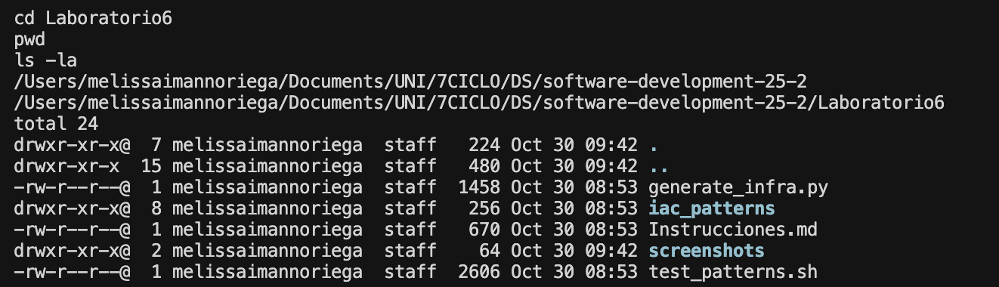
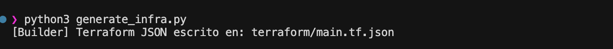
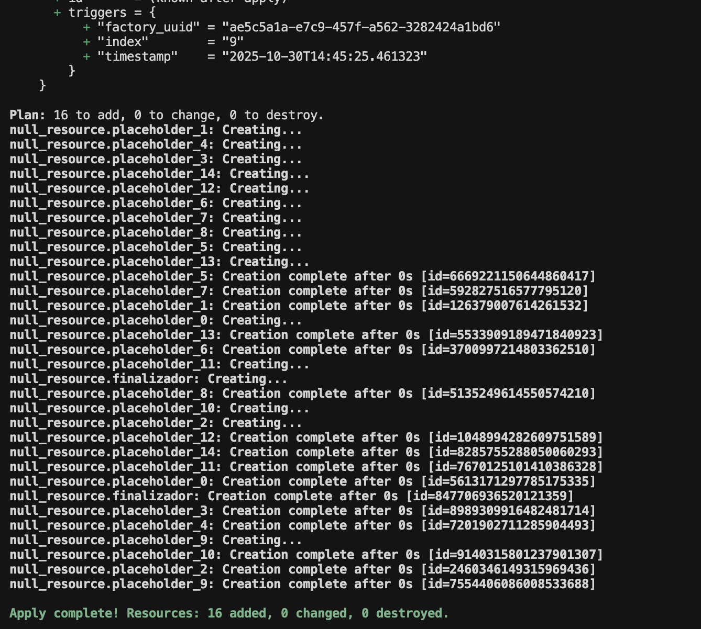

# Laboratorio 6

---

## Estructura del proyecto

El laboratorio tiene los archivos de patrones de diseño en la carpeta `iac_patterns/` con 5 archivos Python (singleton, factory, prototype, builder, composite). También está el script principal `generate_infra.py` que usa todos los patrones.

---

## Patrones implementados

Se implementaron 5 patrones de diseño para generar infraestructura con Terraform:

**Singleton:** Crea una configuración global única que se comparte en todo el sistema. Usa locks para ser thread-safe.

**Factory:** Genera recursos `null_resource` de Terraform con UUIDs únicos y timestamps automáticos.

**Prototype:** Clona recursos existentes y los modifica sin tocar el original. Usa `copy.deepcopy` para clonar.

**Composite:** Combina múltiples recursos en una sola estructura. Agrega todos los recursos hijos y los exporta como un JSON único.

**Builder:** Construye infraestructura de forma fluida. Combina los otros patrones para generar flotas de recursos con una API simple.

---

## Generación del archivo Terraform

Se ejecutó `python3 generate_infra.py` para generar la configuración de Terraform.

El script crea el archivo `terraform/main.tf.json` que contiene 16 recursos en formato JSON.

---

## Contenido generado

El JSON generado tiene 16 recursos null_resource: 15 placeholders (del 0 al 14) más un recurso finalizador.

Cada recurso tiene triggers con UUID único, timestamp y un índice.

---

## Terraform plan

Se ejecutó `terraform init` para inicializar y luego `terraform plan` para ver qué recursos se van a crear.

El plan muestra los 16 recursos que se van a agregar. Cada uno con su configuración de triggers.

---

## Terraform apply

Se aplicó la configuración con `terraform apply -auto-approve` para crear los recursos.

Los 16 recursos se crearon exitosamente. Terraform los crea en paralelo y asigna IDs únicos a cada uno.

---

## Limpieza

Se ejecutó `terraform destroy -auto-approve` para eliminar los recursos creados. Los 16 recursos se destruyeron sin problemas.
