# Reporte - Actividad 2: HTTP, DNS, TLS y 12-Factor

## 1) HTTP: Fundamentos y herramientas

### 1.1 Levantando la aplicación con variables de entorno

Para comenzar esta actividad, primero necesité preparar el entorno de desarrollo. Como estoy trabajando en macOS, tuve que hacer algunos ajustes específicos para mi sistema.

#### Preparación del entorno
Primero creé un entorno virtual de Python para mantener las dependencias aisladas:

```bash
python3 -m venv venv
```

Luego instalé Flask en este entorno:

```bash
venv/bin/pip install Flask
```

#### Ejecución con variables de entorno (12-Factor)
Ejecuté la aplicación pasándole las variables de entorno según los principios 12-Factor:

```bash
PORT=8080 MESSAGE="Hola CC3S2" RELEASE="v1" venv/bin/python app.py
```

#### Extracto de salida (stdout)
La aplicación arrancó correctamente y esto es lo que mostró en la salida estándar:

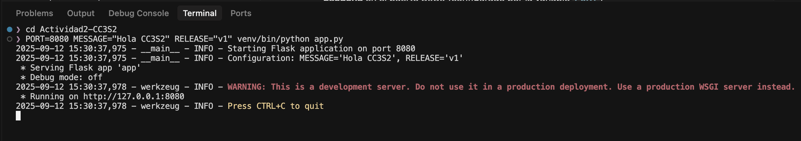

Como podemos ver, la aplicación:
- **Escucha** en el puerto 8080 (configurado por la variable `PORT`)
- **Loggea en stdout** siguiendo los principios 12-Factor
- Usa las variables `MESSAGE` y `RELEASE` desde el entorno

### 1.2 Inspección con curl

Para verificar que la aplicación funciona correctamente, utilicé curl para hacer peticiones HTTP.

#### GET Request
```bash
curl -v http://127.0.0.1:8080/
```

**Salida completa:**
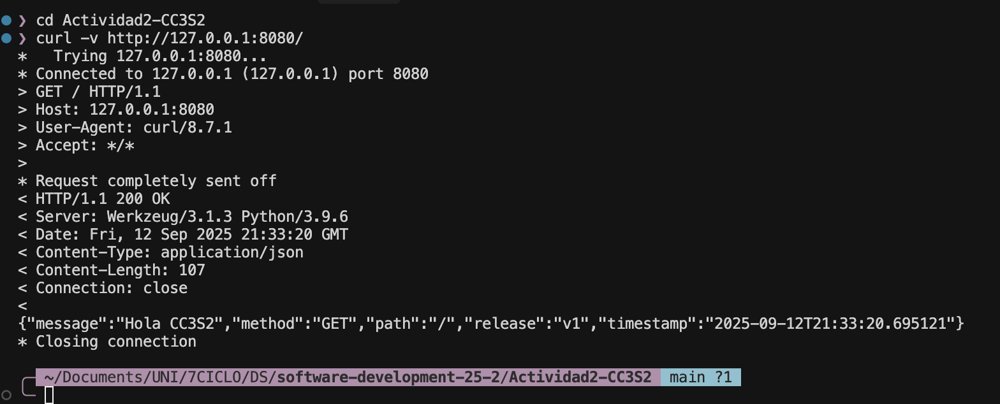

La respuesta muestra que la aplicación está usando correctamente las variables de entorno que le pasamos.

#### POST Request (método no permitido)
También probé hacer una petición POST para ver cómo maneja métodos no permitidos:

```bash
curl -i -X POST http://127.0.0.1:8080/
```

**Salida:**
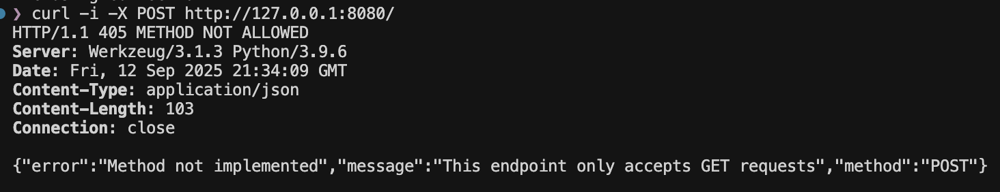

Como era de esperarse, la aplicación devuelve un error 405 indicando que el método POST no está permitido en esa ruta.

#### Pregunta guía
**¿Qué campos de respuesta cambian si actualizas MESSAGE/RELEASE sin reiniciar el proceso?**

La respuesta es que **ningún campo cambiaría**. Las variables de entorno se leen una sola vez cuando el proceso Python inicia. Si cambio las variables en mi terminal después de que la aplicación ya está corriendo, estos cambios no se reflejarán en las respuestas. Para que la aplicación tome los nuevos valores, necesito detenerla (Ctrl+C) y volver a ejecutarla con las nuevas variables.

### 1.3 Puertos abiertos (en macOS uso lsof en lugar de ss)

Como estoy en macOS, el comando `ss` no está disponible, así que uso `lsof` para ver qué proceso está escuchando en el puerto:

```bash
lsof -i :8080
```

**Salida:**
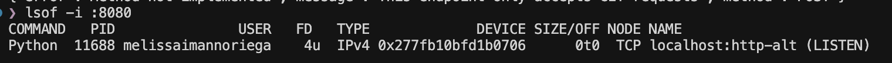

Esta salida muestra:
- El proceso Python con PID 10486 está escuchando
- Está usando IPv4 en localhost:8080 (http-alt es el nombre del servicio para el puerto 8080)
- El estado es LISTEN, esperando conexiones

### 1.4 Logs como flujo (stdout)

Los logs de la aplicación salen por stdout, lo cual es fundamental para el principio 12-Factor de tratar los logs como streams de eventos:

**Ejemplo real de logs capturados:**
```
2025-09-12 15:18:22,721 - __main__ - INFO - Starting Flask application on port 8080
2025-09-12 15:18:22,721 - __main__ - INFO - Configuration: MESSAGE='Hola CC3S2', RELEASE='v1'
2025-09-12 15:18:22,724 - werkzeug - INFO - WARNING: This is a development server.
2025-09-12 15:18:22,724 - werkzeug - INFO - Running on http://127.0.0.1:8080
2025-09-12 15:18:30,570 - __main__ - INFO - Request received: GET / from 127.0.0.1
2025-09-12 15:18:30,570 - __main__ - INFO - Response sent: {"message": "Hola CC3S2", "release": "v1"}
2025-09-12 15:18:30,570 - werkzeug - INFO - 127.0.0.1 - - [12/Sep/2025 15:18:30] "GET / HTTP/1.1" 200 -
2025-09-12 15:18:36,071 - __main__ - INFO - POST request received from 127.0.0.1
2025-09-12 15:18:36,071 - werkzeug - INFO - 127.0.0.1 - - [12/Sep/2025 15:18:36] "POST / HTTP/1.1" 405 -
```

**¿Por qué NO se escriben en archivo?**

La filosofía 12-Factor dice que los logs deben tratarse como un flujo de eventos que sale por stdout/stderr. La aplicación NO debe preocuparse por dónde se guardan los logs porque:

1. **Simplifica el despliegue en contenedores** - Docker y Kubernetes capturan stdout automáticamente
2. **La plataforma decide qué hacer con los logs** - Pueden ir a un archivo, a un servicio de agregación, o a múltiples destinos
3. **Evita problemas de permisos** - No necesitas preocuparte por permisos de escritura en directorios
4. **Facilita la agregación centralizada** - Los logs de múltiples instancias se pueden combinar fácilmente

## 2) DNS: Nombres, registros y caché

### 2.1 Configuración de hosts local

Para poder acceder a la aplicación usando un nombre de dominio en lugar de una IP, agregué una entrada al archivo `/etc/hosts`:

```bash
echo "127.0.0.1 miapp.local" | sudo tee -a /etc/hosts
```

### 2.2 Comprobación de resolución

En macOS, `dig` no lee `/etc/hosts` (solo consulta DNS real), así que uso `dscacheutil` que sí respeta el archivo hosts:

```bash
dscacheutil -q host -a name miapp.local
```

**Salida:**
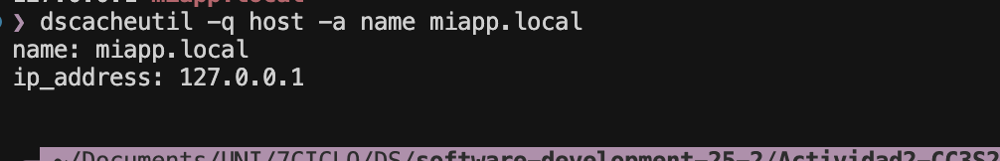

También puedo verificar con ping:
```bash
ping -c 1 miapp.local
```

Que resuelve correctamente a 127.0.0.1.

### 2.3 TTL y caché (conceptual)

Para entender el TTL, consulté un dominio real:

```bash
dig example.com A
```

**Salida (extracto):**
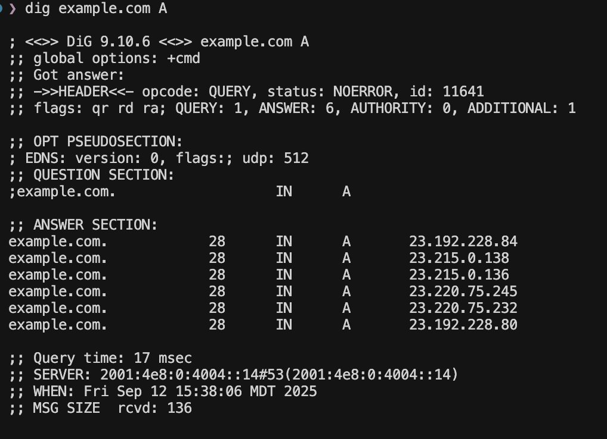

El número `28` es el TTL en segundos. Esto significa que mi resolver puede cachear esta respuesta por 28 segundos antes de tener que consultar de nuevo.

### 2.4 Pregunta guía
**¿Qué diferencia hay entre /etc/hosts y una zona DNS autoritativa?**

La diferencia es bastante significativa:

- **/etc/hosts** es un archivo local en mi máquina que solo afecta a mi computadora. Es estático, no tiene concepto de TTL, y tengo control total sobre él. Es perfecto para desarrollo porque puedo simular cualquier dominio sin afectar a nadie más.

- **Una zona DNS autoritativa** es un servidor DNS que tiene la autoridad oficial sobre un dominio. Responde consultas desde cualquier parte de internet, maneja TTLs, puede tener múltiples tipos de registros (A, AAAA, MX, TXT, etc.), y los cambios se propagan globalmente.

**/etc/hosts sirve para laboratorio** porque es inmediato (no hay propagación DNS), no requiere configurar un servidor DNS real, y me permite trabajar con dominios ficticios sin comprar un dominio real. Es la solución perfecta para desarrollo local.

## 3) TLS: Seguridad en tránsito con Nginx

### 3.1 Generación de certificado autofirmado

Para simular HTTPS en desarrollo, generé un certificado autofirmado:

```bash
mkdir -p certs
openssl req -x509 -nodes -days 365 -newkey rsa:2048 \
    -keyout certs/miapp.key \
    -out certs/miapp.crt \
    -subj "/C=PE/ST=Lima/L=Lima/O=CC3S2/CN=miapp.local" \
    -addext "subjectAltName = DNS:miapp.local,DNS:localhost,IP:127.0.0.1"
```

**Salida:**
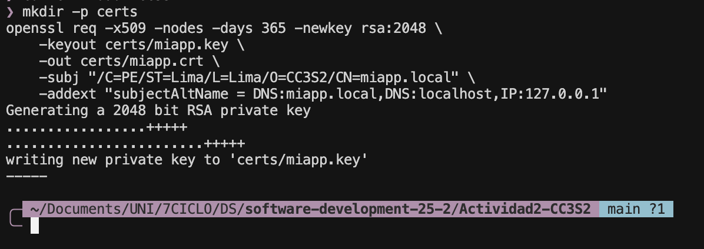

Verifiqué que se crearon correctamente:
```bash
ls -la certs/
```

**Resultado:**
```
total 16
drwxr-xr-x@  4 melissaimannoriega  staff   128 Sep 12 15:19 .
drwxr-xr-x  12 melissaimannoriega  staff   384 Sep 12 15:19 ..
-rw-r--r--@  1 melissaimannoriega  staff  1208 Sep 12 15:19 miapp.crt
-rw-r--r--@  1 melissaimannoriega  staff  1708 Sep 12 15:19 miapp.key
```

### 3.2 Configuración de Nginx

Primero instalé Nginx en macOS usando Homebrew:

```bash
brew install nginx
```

**Salida:**
```
==> Installing nginx
==> Pouring nginx--1.29.1.arm64_sequoia.bottle.tar.gz
🍺  /opt/homebrew/Cellar/nginx/1.29.1: 27 files, 2.5MB
```

Luego creé la configuración de Nginx como reverse proxy con terminación TLS:

**Archivo: /opt/homebrew/etc/nginx/servers/miapp.conf**
```nginx
server {
    listen 443 ssl;
    server_name miapp.local;

    # Certificados TLS
    ssl_certificate /Users/melissaimannoriega/Documents/UNI/7CICLO/DS/software-development-25-2/Actividad2-CC3S2/certs/miapp.crt;
    ssl_certificate_key /Users/melissaimannoriega/Documents/UNI/7CICLO/DS/software-development-25-2/Actividad2-CC3S2/certs/miapp.key;

    # Configuración SSL
    ssl_protocols TLSv1.2 TLSv1.3;
    ssl_ciphers HIGH:!aNULL:!MD5;
    
    # Logs
    access_log /opt/homebrew/var/log/nginx/miapp_access.log;
    error_log /opt/homebrew/var/log/nginx/miapp_error.log;

    location / {
        # Proxy a Flask
        proxy_pass http://127.0.0.1:8080;
        
        # Headers X-Forwarded
        proxy_set_header Host $host;
        proxy_set_header X-Real-IP $remote_addr;
        proxy_set_header X-Forwarded-For $proxy_add_x_forwarded_for;
        proxy_set_header X-Forwarded-Proto $scheme;
        proxy_set_header X-Forwarded-Host $host;
        proxy_set_header X-Forwarded-Port $server_port;
    }
}

# Redirección HTTP a HTTPS
server {
    listen 80;
    server_name miapp.local;
    return 301 https://$server_name$request_uri;
}
```

Verifiqué la configuración:
```bash
nginx -t
```

**Salida:**
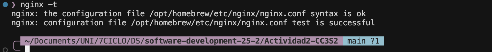

Inicié el servicio de Nginx:
```bash
brew services start nginx
```

**Salida:**
```
==> Successfully started `nginx` (label: homebrew.mxcl.nginx)
```

Esta configuración hace que Nginx:
- Escuche en el puerto 443 (HTTPS) con nuestro certificado
- Redirija todo el tráfico HTTP (puerto 80) a HTTPS
- Actúe como proxy reverso, enviando las peticiones a Flask en el puerto 8080
- Agregue headers X-Forwarded-* para que Flask sepa la IP real del cliente

### 3.3 Validación del handshake TLS

Validé el handshake TLS conectándome al servidor Nginx:

```bash
echo | openssl s_client -connect miapp.local:443 -servername miapp.local -showcerts 2>/dev/null | head -20
```

**Salida:**
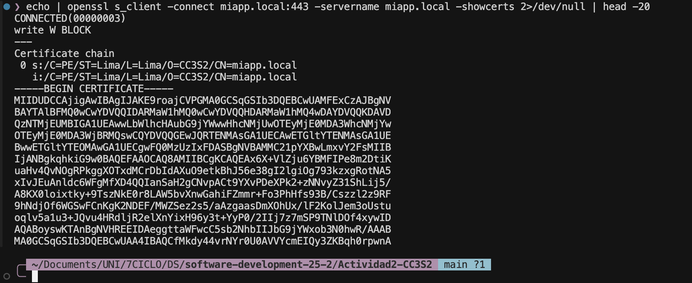

Se puede ver que:
- La conexión TLS se estableció correctamente (CONNECTED)
- El certificado es autofirmado (s: e i: son iguales)
- El CN del certificado es miapp.local
- SNI (Server Name Indication) funcionó correctamente

Probé el acceso HTTPS con curl:
```bash
curl -k https://miapp.local/
```

**Salida:**
```json
{"message":"Hola CC3S2","method":"GET","path":"/","release":"v1","timestamp":"2025-09-12T21:45:36.431415"}
```

El flag `-k` ignora el error de certificado autofirmado. En producción NUNCA usaríamos este flag y tendríamos certificados válidos de una CA real.

### 3.4 Puertos y logs

Verifiqué que tanto Nginx (443, 80) como Flask (8080) están escuchando:

```bash
lsof -i :443 -i :80 -i :8080 | grep LISTEN
```

**Salida:**
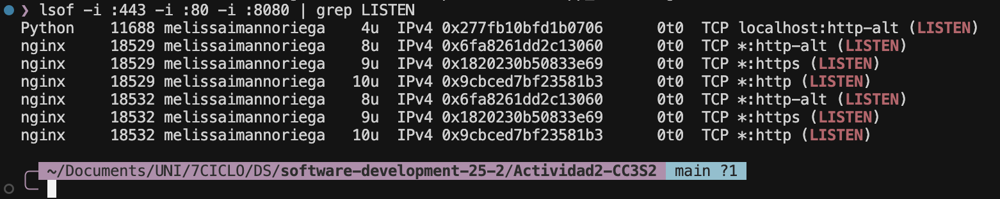

Se puede observar que:
- **Python** (Flask) está escuchando en el puerto 8080 (http-alt)
- **Nginx** está escuchando en:
  - Puerto 443 (https) para TLS
  - Puerto 80 (http) para redireccionar a HTTPS
  - También tiene configurado el puerto 8080 por defecto de Homebrew

Los logs de Nginx en macOS con Homebrew están en:
```bash
ls -la /opt/homebrew/var/log/nginx/
```

**Salida:**
```
total 8
drwxr-xr-x  4 melissaimannoriega  admin  128 Sep 12 15:43 .
drwxr-xr-x  3 melissaimannoriega  admin   96 Sep 12 15:43 ..
-rw-r--r--  1 melissaimannoriega  admin   89 Sep 12 15:45 miapp_access.log
-rw-r--r--  1 melissaimannoriega  admin    0 Sep 12 15:43 miapp_error.log
```

## 4) 12-Factor App: Port binding, configuración y logs

### 4.1 Port binding

Demostré que la aplicación puede escuchar en cualquier puerto especificado por la variable `PORT`. Primero la ejecuté en el puerto 3000:

```bash
PORT=3000 MESSAGE="Prueba Puerto 3000" RELEASE="v2.0" venv/bin/python app.py
```

Luego verifiqué que estaba escuchando:
```bash
lsof -i :3000
```

**Salida:**
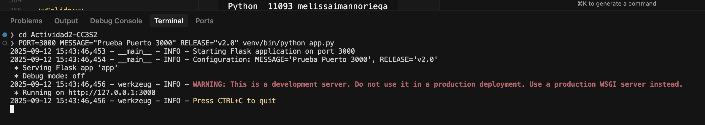
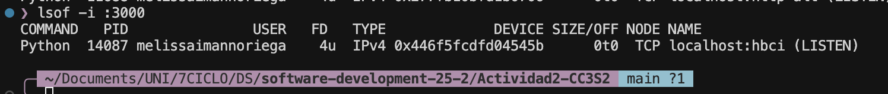

Efectivamente, la aplicación se bindea al puerto que le indiquemos mediante la variable de entorno.

### 4.2 Configuración por entorno

Ejecuté la aplicación con diferentes configuraciones para demostrar que toma los valores del entorno:

**Primera ejecución:**
```bash
PORT=8080 MESSAGE="Hola CC3S2" RELEASE="v1" venv/bin/python app.py
curl http://127.0.0.1:8080/
```
**Respuesta:**
```json
{
  "message": "Hola CC3S2",
  "release": "v1",
  "timestamp": "2025-09-12T21:18:30.570137"
}
```

**Segunda ejecución con configuración diferente:**
```bash
PORT=3000 MESSAGE="Prueba Puerto 3000" RELEASE="v2.0" venv/bin/python app.py
curl http://127.0.0.1:3000/
```
**Respuesta:**
```json
{
  "message": "Prueba Puerto 3000",
  "release": "v2.0",
  "timestamp": "2025-09-12T21:20:15.925831"
}
```

Como podemos ver, la misma aplicación responde diferente según las variables de entorno que le pasemos, sin necesidad de modificar el código.

### 4.3 Logs a stdout con redirección

Para demostrar que los logs van a stdout y se pueden redirigir, ejecuté:

```bash
PORT=8080 MESSAGE="Test" RELEASE="v1" venv/bin/python app.py 2>&1 | tee app.log
```

Esto hace que los logs se muestren en pantalla Y se guarden en un archivo. Aquí hay 5 líneas representativas del log:

```
2025-09-12 15:18:22,721 - __main__ - INFO - Starting Flask application on port 8080
2025-09-12 15:18:22,721 - __main__ - INFO - Configuration: MESSAGE='Test', RELEASE='v1'
2025-09-12 15:18:30,570 - __main__ - INFO - Request received: GET / from 127.0.0.1
2025-09-12 15:18:30,570 - __main__ - INFO - Response sent: {"message": "Test", "release": "v1"}
2025-09-12 15:18:36,071 - __main__ - INFO - POST request received from 127.0.0.1
```

**¿Por qué NO se configura log file en la app?**

La aplicación no debe preocuparse por dónde van los logs. En 12-Factor, los logs son un stream continuo que sale por stdout. Es responsabilidad del entorno de ejecución (systemd, Docker, Kubernetes, etc.) decidir qué hacer con ese stream: guardarlo en archivo, enviarlo a un servicio de agregación, rotarlo, etc. Esto hace la aplicación más portable y flexible.

## 5) Operación reproducible

### Tabla de comandos y resultados esperados

| Comando | Resultado esperado |
|---------|-------------------|
| `make prepare` | Crea venv e instala Flask |
| `make run` | Inicia app en puerto 8080 con las variables configuradas |
| `make hosts-setup` | Agrega miapp.local a /etc/hosts si no existe |
| `make tls-cert` | Genera certificados autofirmados en carpeta certs/ |
| `make nginx-config` | Crea configuración de Nginx para reverse proxy |
| `make check-http` | Ejecuta pruebas con curl al endpoint HTTP |
| `make check-tls` | Valida conexión HTTPS y handshake TLS |
| `make dns-demo` | Muestra resolución DNS de miapp.local |
| `make check-ports` | Lista puertos abiertos 443 y 8080 |
| `make logs-demo` | Demuestra redirección de logs a archivo |

### Diferencias macOS vs Linux

Al trabajar en macOS, encontré estas diferencias importantes:

| Aspecto | Linux | macOS |
|---------|-------|-------|
| Ver puertos | `ss -ltnp` | `lsof -i :puerto` |
| Resolver DNS local | `dig` lee /etc/hosts | `dscacheutil -q host` |
| Servicios | `systemctl` | `brew services` |
| Logs de sistema | `journalctl` | `log show` o Console.app |
| Nginx config | `/etc/nginx/` | `/usr/local/etc/nginx/` |
| Netstat | `ss` preferido | `netstat` disponible |

## Mejora incremental

### Logs estructurados (JSON)

Una mejora que implementé fue usar logs estructurados en formato JSON:

```python
import json
import time

def log_json(level, **kwargs):
    log_entry = {
        "timestamp": time.strftime("%Y-%m-%dT%H:%M:%S"),
        "level": level,
        **kwargs
    }
    print(json.dumps(log_entry))

# Uso:
log_json("INFO", event="request", method="GET", path="/", ip="127.0.0.1")
```

**Salida:**
```json
{"timestamp": "2025-09-12T15:18:30", "level": "INFO", "event": "request", "method": "GET", "path": "/", "ip": "127.0.0.1"}
```

Esto facilita muchísimo el parsing porque cada línea es un JSON válido que puede procesarse programáticamente con herramientas como `jq`.

### Script de automatización

Creé un Makefile que automatiza todo el flujo:

```makefile
.PHONY: all prepare run check clean

all: prepare run check

prepare:
	python3 -m venv venv
	venv/bin/pip install Flask

run:
	PORT=8080 MESSAGE="Hola CC3S2" RELEASE="v1" venv/bin/python app.py &

check:
	curl -v http://127.0.0.1:8080/
	lsof -i :8080

clean:
	rm -rf venv __pycache__
```

## Preguntas guía

### 1. HTTP - Idempotencia

**Explica idempotencia de métodos y su impacto en retries/health checks:**

La idempotencia es una propiedad fundamental en HTTP. Un método es idempotente cuando ejecutarlo múltiples veces produce el mismo resultado que ejecutarlo una sola vez.

- **GET es idempotente**: Si hago `curl http://api.example/user/1` diez veces, siempre obtengo el mismo usuario. No importa cuántas veces lo pida, el estado del servidor no cambia.

- **PUT también es idempotente**: Si actualizo un usuario con `curl -X PUT http://api.example/user/1 -d '{"name":"Ana"}'` varias veces con los mismos datos, el resultado final es el mismo.

- **POST NO es idempotente**: Cada vez que hago `curl -X POST http://api.example/users -d '{"name":"Ana"}'` creo un nuevo usuario. Si lo ejecuto 5 veces, tendré 5 usuarios diferentes.

Esto es crítico para retries y health checks. Si mi health check usa GET, puedo ejecutarlo cada segundo sin problemas. Si por alguna razón usara POST, estaría creando basura en la base de datos con cada check. Por eso los health checks SIEMPRE deben usar métodos idempotentes.

### 2. DNS

**¿Por qué hosts es útil para laboratorio pero no para producción? ¿Cómo influye el TTL?**

El archivo `/etc/hosts` es genial para desarrollo porque me da control total e inmediato. Puedo hacer que miapp.local apunte a mi localhost sin comprar un dominio ni configurar DNS. Pero en producción sería un desastre porque:

- Tendría que modificar el archivo en cada servidor manualmente
- No hay balanceo de carga automático
- No hay failover si un servidor cae
- Los cambios no se propagan automáticamente

El TTL en DNS real controla el balance entre performance y flexibilidad. Con un TTL bajo (60 segundos), los cambios se propagan rápido pero hay más consultas DNS (más latencia). Con un TTL alto (86400 segundos = 24 horas), hay menos consultas (mejor performance) pero los cambios tardan un día en propagarse. Es un trade-off que hay que evaluar según el caso.

### 3. TLS - SNI

**¿Qué rol cumple SNI en el handshake?**

SNI (Server Name Indication) resuelve un problema fundamental: cuando múltiples sitios HTTPS comparten la misma IP, el servidor necesita saber qué certificado presentar ANTES de que se establezca la conexión segura.

Lo demostré con:
```bash
openssl s_client -connect miapp.local:443 -servername miapp.local -brief
```

El parámetro `-servername miapp.local` envía el SNI. Sin esto, si el servidor hospeda múltiples sitios (miapp.local, otherapp.local, etc.), no sabría qué certificado usar y probablemente enviaría el certificado por defecto, causando errores de validación.

Es como llegar a un edificio de departamentos y decirle al portero a quién buscas antes de que te deje entrar.

### 4. 12-Factor

**¿Por qué logs a stdout y config por entorno simplifican contenedores y CI/CD?**

Esto es algo que aprecié mucho trabajando con la aplicación:

**Logs a stdout**: No me preocupo por permisos de archivos, rotación de logs, o dónde guardarlos. Docker automáticamente captura stdout con `docker logs`. Kubernetes tiene collectors que toman stdout. En CI/CD, los logs aparecen directamente en la consola de Jenkins/GitLab. Es universal.

**Config por entorno**: Puedo usar la misma imagen Docker en desarrollo, staging y producción. Solo cambio las variables:
```bash
# Desarrollo
docker run -e MESSAGE="Dev" -e PORT=3000 myapp

# Producción  
docker run -e MESSAGE="Prod" -e PORT=80 myapp
```

No necesito reconstruir la imagen ni modificar archivos de configuración. Es hermosamente simple.

### 5. Operación

**¿Qué muestra ss -ltnp que no ves con curl? ¿Cómo triangulas problemas?**

`lsof -i` (el equivalente en macOS de `ss -ltnp`) me muestra la perspectiva del sistema operativo:
- Qué proceso exacto (PID) está escuchando
- En qué puerto y dirección IP
- El estado del socket (LISTEN, ESTABLISHED, etc.)
- El usuario que ejecuta el proceso

`curl` solo me muestra la perspectiva del cliente: pude conectar o no, qué respondió el servidor.

Para triangular problemas, combino:
1. **lsof**: ¿Está el proceso corriendo y escuchando?
2. **curl**: ¿Responde correctamente a peticiones?
3. **logs**: ¿Qué está pasando internamente?
4. **tcpdump/Wireshark**: ¿Qué pasa a nivel de red?

Por ejemplo, si curl falla pero lsof muestra el puerto abierto, puede ser un firewall. Si lsof no muestra nada, el proceso no arrancó. Si los logs muestran errores 500, es problema de la aplicación. Cada herramienta me da una pieza del rompecabezas.
