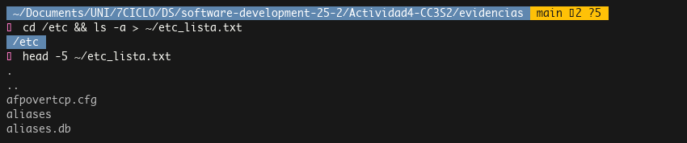
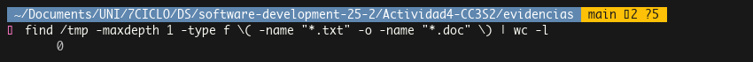
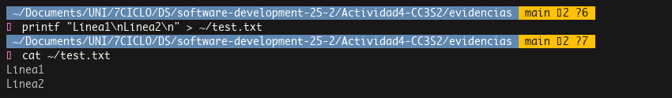
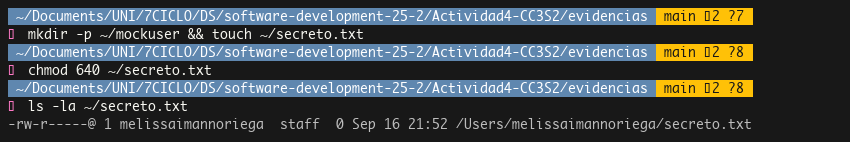
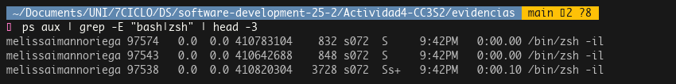
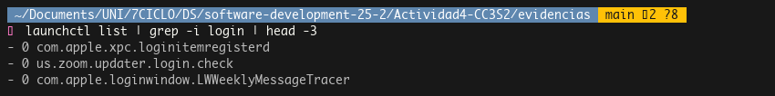
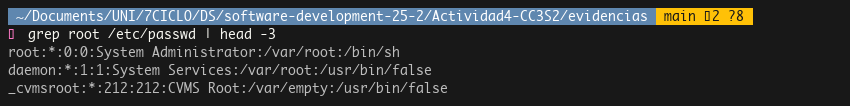
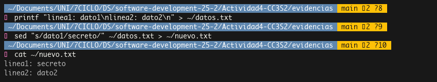
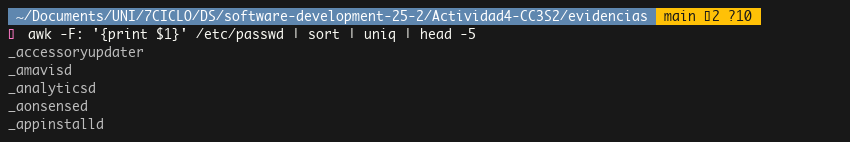
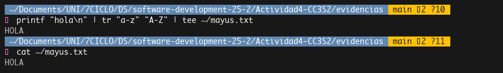

# Respuestas Actividad 4: Herramientas CLI en Unix-like para DevSecOps

## Sección 1: Manejo sólido de CLI

### Ejercicio 1: Navegación y redirección
Navegamos al directorio `/etc` para listar todos los archivos incluyendo los ocultos y guardamos la salida en un archivo en el home del usuario. El comando `ls -a` muestra archivos ocultos que empiezan con punto y el operador `>` redirige la salida al archivo.

En el output vemos los archivos de configuración del sistema como `afpovertcp.cfg`, `aliases`, `apache2`, etc. El `.` y `..` son referencias al directorio actual y al padre respectivamente.

### Ejercicio 2: Globbing con find y pipes
Usamos `find` con globbing para buscar archivos `.txt` y `.doc` en `/tmp`. El comando es más robusto que un simple `ls` porque maneja bien espacios en nombres y usa `-maxdepth 1` para no buscar recursivamente. La tubería `| wc -l` cuenta las líneas del output, dándonos el total de archivos.

En este caso encontramos 0 archivos, lo cual es normal en `/tmp` recién iniciado el sistema.

### Ejercicio 3: Creación de archivos con printf
Creamos un archivo de prueba usando `printf` que es más seguro que `echo` para caracteres especiales. El `\n` genera saltos de línea y verificamos con `cat` que muestra el contenido del archivo.

El archivo se creó correctamente con las dos líneas especificadas.

## Sección 2: Administración básica

### Ejercicio 1: Permisos y usuarios mock
Como estamos en un entorno personal, creamos un directorio mock en vez de un usuario real para no alterar el sistema. Aplicamos permisos 640 que significa lectura y escritura para el dueño (6=rw-), solo lectura para el grupo (4=r--) y sin permisos para otros (0=---).

El `@` en los permisos indica atributos extendidos de macOS, y vemos que el archivo pertenece al usuario `melissaimannoriega` y grupo `staff`.

### Ejercicio 2: Listado de procesos shell
Buscamos procesos de shell activos con `ps aux` y filtramos con `grep` para bash o zsh. Los campos muestran usuario, PID, uso de CPU/memoria, terminal (tty), estado y comando. El estado 'S' significa sleeping (esperando eventos) y 'Ss+' significa session leader sleeping en foreground.

Vemos varios procesos zsh que son las diferentes pestañas de terminal abiertas. El flag `-il` significa interactive login shell.

### Ejercicio 3: Servicios del sistema
En macOS usamos `launchctl` en lugar de systemd. Buscamos servicios relacionados con login para ver qué se ejecuta al iniciar sesión. Los números son el PID (0 significa no está corriendo actualmente) y el exit status.

Los servicios mostrados manejan items de login, actualizaciones de Zoom al login y mensajes semanales del sistema.

## Sección 3: Utilidades de texto Unix

### Ejercicio 1: Búsqueda con grep
Usamos `grep` para buscar el patrón "root" en `/etc/passwd`. Este archivo contiene información de usuarios del sistema con campos separados por `:` (usuario:password:UID:GID:descripción:home:shell).

Encontramos el usuario root (UID 0, el superusuario), daemon (servicios del sistema) y _cvmsroot (servicios de Content Caching). El `*` en el campo password indica que está en el sistema de shadow passwords.

### Ejercicio 2: Sustitución con sed
Creamos un archivo con datos y usamos `sed` para sustituir texto. El comando `s/viejo/nuevo/` es la sintaxis de sustitución. Redirigimos a un archivo nuevo para preservar el original.

El sed cambió "dato1" por "secreto" solo en la primera línea que coincidía, dejando "dato2" sin modificar.

### Ejercicio 3: Procesamiento con awk
Extraemos la primera columna de `/etc/passwd` usando awk con el separador `:`. El pipeline con `sort | uniq` ordena alfabéticamente y elimina duplicados, aunque en `/etc/passwd` no debería haber usuarios duplicados.

Los usuarios con `_` al inicio son usuarios del sistema para servicios específicos como actualizaciones, análisis, eventos de Apple, etc.

### Ejercicio 4: Transformación con tr y tee
Usamos `tr` para transformar minúsculas a mayúsculas. El comando `tee` es útil porque muestra el resultado en pantalla Y lo guarda en un archivo simultáneamente, ideal para logging en DevSecOps.

El texto "hola" se transformó correctamente a "HOLA" y se guardó en el archivo `mayus.txt`.
