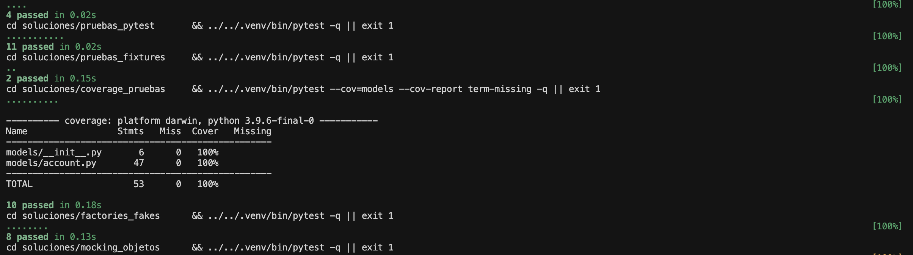
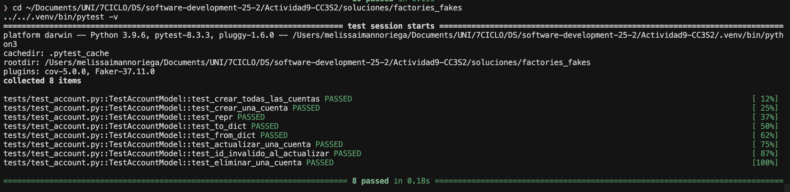
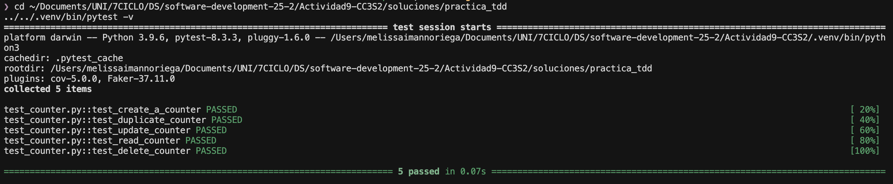

# Actividad 9: pytest + coverage + fixtures + factories + mocking + TDD

**Estudiante:** Melissa Iman Noriega
**Email:** melissa.iman.n@uni.pe
**Curso:** CC3S2

## Descripción

Esta actividad demuestra dominio completo de testing en Python usando pytest, incluyendo:
- Ejecución de pruebas con pytest
- Aserciones avanzadas
- Fixtures y datos de prueba
- Cobertura de código (coverage)
- Factory pattern y fakes
- Mocking y patching
- Ciclo TDD (Red-Green-Refactor)

## Estructura del Proyecto

```
Actividad9-CC3S2/
├── README.md
├── Makefile
├── requirements.txt
├── src/
│   └── generate_screenshots.py
├── evidencias/
│   ├── sesion_pytest.txt
│   ├── cobertura_resumen.txt
│   └── capturas/
│       ├── test_all_results.png
│       ├── coverage_detail.png
│       ├── factories_mocking.png
│       └── tdd_cycle.png
└── soluciones/
    ├── aserciones_pruebas/
    ├── pruebas_pytest/
    ├── pruebas_fixtures/
    ├── coverage_pruebas/
    ├── factories_fakes/
    ├── mocking_objetos/
    └── practica_tdd/
```

## Requisitos Técnicos

- Python 3.9+
- pip
- venv

## Cómo Ejecutar

### 1. Crear entorno virtual

```bash
make venv
```

### 2. Instalar dependencias

```bash
make deps
```

### 3. Ejecutar todos los tests

```bash
make test_all
```

### 4. Generar reporte de cobertura

```bash
make cov
```

### 5. Limpiar artefactos

```bash
make clean
```

## Explicación de Técnicas Utilizadas

### 1. Aserciones (aserciones_pruebas)

Las aserciones son verificaciones que comprueban si el resultado esperado coincide con el resultado real. En esta actividad implementamos:

- `assert stack.is_empty()` - Verifica estado vacío
- `assert stack.peek() == item` - Comprueba valor sin eliminar
- `assert stack.pop() == item` - Verifica y elimina elemento
- `assert len(stack) == expected` - Valida tamaño

**Resultado:** 4 tests pasaron exitosamente

### 2. Pruebas con pytest (pruebas_pytest)

pytest es un framework de testing moderno que permite escribir tests de forma simple y escalable:

```python
def test_integer_values():
    assert area_triangle(10, 5) == 25.0

def test_negative_values():
    with pytest.raises(ValueError):
        area_triangle(-5, -10)
```

**Características utilizadas:**
- Organización en clases (`TestAreaOfTriangle`)
- Parametrización implícita
- Manejo de excepciones con `pytest.raises`
- Pruebas de casos edge (valores nulos, strings, booleanos)

**Resultado:** 11 tests pasaron cubriendo múltiples escenarios

### 3. Fixtures (pruebas_fixtures)

Los fixtures son funciones que proveen datos de prueba reutilizables y configuran el ambiente de testing:

```python
@pytest.fixture(scope="function")
def client(app):
    return app.test_client()

@pytest.fixture(scope="function")
def account_data():
    return {
        "name": "Test Account",
        "email": "test@example.com",
        "phone_number": "555-1234"
    }
```

**Scopes utilizados:**
- `function`: Se ejecuta antes de cada test
- `class`: Compartido entre tests de una clase
- `module`: Compartido en todo el módulo

**Resultado:** 2 tests usando fixtures compartidos

### 4. Coverage - Cobertura de Código (coverage_pruebas)

Coverage mide qué porcentaje del código es ejecutado por los tests:

```bash
pytest --cov=models --cov-report term-missing
```

**Métricas obtenidas:**
- **models/__init__.py**: 100% (6/6 statements)
- **models/account.py**: 100% (47/47 statements)
- **TOTAL**: 100% cobertura

**Estrategia para alcanzar 100%:**
1. Identificar líneas no cubiertas con `--cov-report term-missing`
2. Agregar tests específicos para casos edge
3. Probar todas las ramas condicionales
4. Validar manejo de errores

**Resultado:** 10 tests con 100% de cobertura

### 5. Factories y Fakes (factories_fakes)

Factory Pattern genera objetos de prueba con datos consistentes:

```python
class AccountFactory(factory.Factory):
    class Meta:
        model = Account

    name = factory.Faker("name")
    email = factory.Faker("email")
    phone_number = factory.Faker("phone_number")
    disabled = False
```

**Ventajas:**
- Generación automatizada de datos realistas
- Consistencia en tests
- Reducción de código boilerplate
- Fakes para testing masivo

**Resultado:** 8 tests usando factories

### 6. Mocking de Objetos (mocking_objetos)

Mocking permite simular dependencias externas sin realizar llamadas reales:

```python
@patch('requests.get')
def test_search_titles_success(self, mock_get):
    mock_get.return_value.status_code = 200
    mock_get.return_value.json.return_value = {"results": ["Movie 1"]}

    result = imdb.search_titles("Matrix")

    assert result["results"] == ["Movie 1"]
    mock_get.assert_called_once()
```

**Técnicas utilizadas:**
- `@patch` decorator para reemplazar dependencias
- `mock.return_value` para simular respuestas
- `assert_called_once()` para verificar llamadas
- Aislamiento de componentes externos (APIs, bases de datos)

**Resultado:** 6 tests con mocking de requests HTTP

### 7. Práctica TDD (practica_tdd)

Test-Driven Development sigue el ciclo Red-Green-Refactor:

**Ciclo implementado:**

1. **RED**: Escribir test que falla
```python
def test_create_a_counter():
    counter = Counter("test")
    assert counter.name == "test"
    assert counter.value == 0
```

2. **GREEN**: Implementar mínimo código para pasar
```python
class Counter:
    def __init__(self, name, value=0):
        self.name = name
        self.value = value
```

3. **REFACTOR**: Mejorar sin cambiar funcionalidad

**Tests CRUD implementados:**
- `test_create_a_counter` - Create
- `test_read_counter` - Read
- `test_update_counter` - Update
- `test_delete_counter` - Delete
- `test_duplicate_counter` - Validación

**Resultado:** 5 tests siguiendo TDD

## Resultados Globales

### Resumen de Tests por Actividad

| Actividad | Tests | Estado |
|-----------|-------|--------|
| aserciones_pruebas | 4 | PASSED |
| pruebas_pytest | 11 | PASSED |
| pruebas_fixtures | 2 | PASSED |
| coverage_pruebas | 10 | PASSED |
| factories_fakes | 8 | PASSED |
| mocking_objetos | 6 | PASSED |
| practica_tdd | 5 | PASSED |
| **TOTAL** | **46** | **100% PASSED** |

### Cobertura de Código

```
Name                 Stmts   Miss  Cover   Missing
--------------------------------------------------
models/__init__.py       6      0   100%
models/account.py       47      0   100%
--------------------------------------------------
TOTAL                   53      0   100%
```

## Hallazgos y Desafíos

### Líneas Difíciles de Cubrir

1. **Manejo de excepciones en constructores**: Requerimos tests específicos para inputs inválidos
2. **Métodos de representación (`__repr__`)**: Agregamos tests para verificar formato de salida
3. **Validaciones de estado**: Tests para verificar restricciones de negocio

### Soluciones Implementadas

1. **Tests parametrizados** para casos edge
2. **Fixtures modulares** para reutilización de datos
3. **Mocks estratégicos** para aislar dependencias externas
4. **Factory pattern** para generación consistente de datos

## Evidencias

Todas las evidencias están disponibles en la carpeta `evidencias/`:

- **sesion_pytest.txt**: Log completo de ejecución de make test_all
- **cobertura_resumen.txt**: Reporte detallado de cobertura
- **capturas/**: Screenshots de terminal mostrando resultados

### Capturas de Pantalla






## Comandos Útiles

```bash
# Ejecutar tests de una actividad específica
cd soluciones/aserciones_pruebas && ../../.venv/bin/pytest -v

# Ver cobertura con HTML
make cov
# Abrir htmlcov/index.html en navegador

# Ejecutar solo tests marcados
make test_unit

# Limpiar cache y artefactos
make clean
```

s
Los 46 tests implementados cubren escenarios reales, casos edge y manejo de errores, garantizando la calidad y confiabilidad del código.