# Laboratorio 7 - Patrones de Arquitectura en IaC


## Introducción

En este laboratorio se exploraron cinco patrones de diseño aplicados a Infraestructura como Código (IaC), utilizando Terraform y Python de manera completamente local. El objetivo fue comprender cómo los patrones clásicos de software pueden aplicarse a la gestión de infraestructura, mejorando la mantenibilidad y escalabilidad del código.

Se trabajó con los siguientes patrones:
1. **Adapter** - Para transformar datos entre diferentes formatos
2. **Facade** - Para simplificar interfaces complejas
3. **Inversión de Control** - Para invertir dependencias entre módulos
4. **Inyección de Dependencias** - Para proveer dependencias explícitamente
5. **Mediator** - Para coordinar múltiples componentes sin acoplamiento

---

## Configuración Inicial del Entorno

Antes de comenzar con los módulos, se verificó que el sistema contara con las herramientas necesarias instaladas.

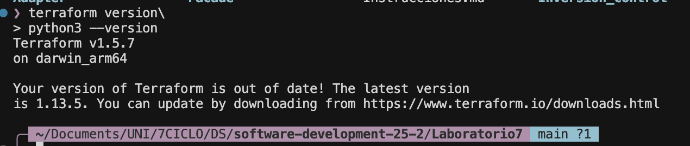
*Figura 1: Verificación de versiones de Terraform y Python en el sistema*

Se confirmó que el entorno cumplía con los requisitos:
- **Terraform v1.5.7** - versión superior al mínimo requerido (1.5)
- **Python 3.9.6** - versión compatible con los scripts del laboratorio

El laboratorio se organizó en 5 carpetas independientes, una para cada patrón: Adapter, Facade, Inversion_control, Inyeccion_dependencias, y Mediator. Esta estructura permitió trabajar con cada patrón de forma aislada.

---

## Módulo 1: Implementación del Patrón Adapter

### Contexto del Problema

El primer patrón a implementar fue **Adapter**. El problema que se planteó resolver fue: ¿cómo transformar datos de usuarios y permisos que están en un formato genérico a recursos que Terraform pueda gestionar?

El patrón Adapter funciona como un traductor que permite que dos interfaces incompatibles trabajen juntas. En este caso, se tenían roles de usuarios (lectura, escritura, administrador) almacenados en un diccionario Python, y se necesitaba convertirlos a recursos `null_resource` de Terraform.

### Proceso de Implementación

Se comenzó ejecutando el script Python que implementa el adaptador. Este script toma los metadatos de usuarios y roles, y genera un archivo JSON que Terraform puede procesar.

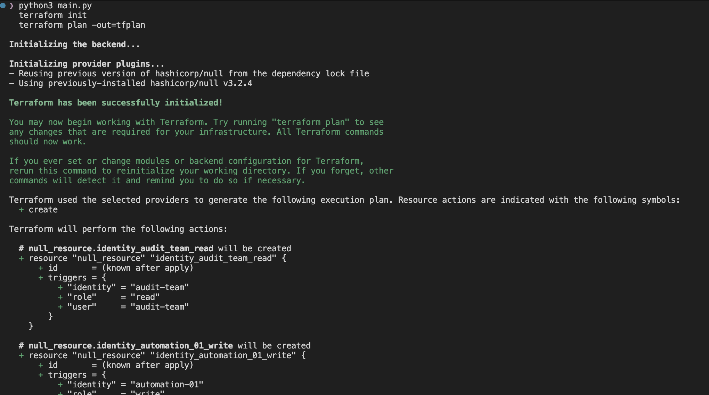
*Figura 2: Generación de configuración y planificación del patrón Adapter*

El script generó exitosamente el archivo `main.tf.json` con 7 recursos. Cada recurso representa una combinación de usuario y rol. Al ejecutar `terraform plan`, se pudo visualizar que se crearían:
- 3 recursos con permisos de lectura (audit-team, user-01, user-02)
- 3 recursos con permisos de escritura (infrastructure-team, user-03, automation-01)
- 1 recurso con permisos de administrador (manager-team)

### Aplicación de Cambios

Una vez verificado el plan, se procedió a aplicar los cambios con `terraform apply`.

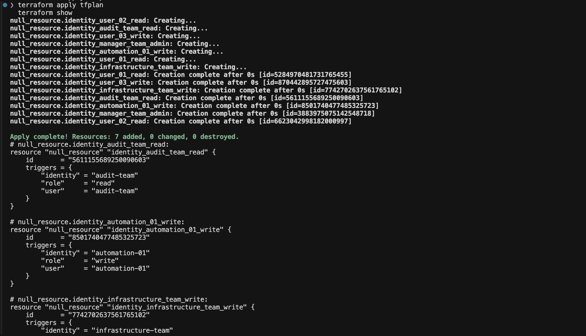
*Figura 3: Creación exitosa de los 7 recursos de identidad*

Los recursos se crearon instantáneamente dado que son recursos locales (`null_resource`). Cada uno quedó registrado en el estado de Terraform con su respectivo ID único y sus triggers que contienen la información de usuario, identidad y rol.

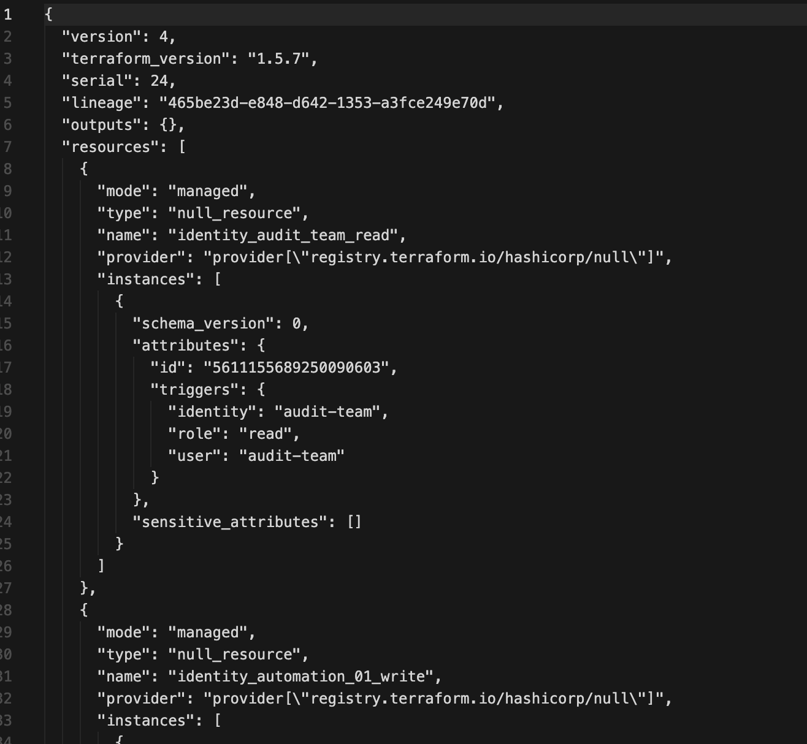
*Figura 4: Estado final mostrando las identidades creadas con sus metadatos*

### Aprendizajes del Patrón Adapter

De esta implementación se extrajo que:

- El Adapter mantiene un **contrato estable** mediante el método `outputs()`, que siempre devuelve tuplas en el formato (usuario, identidad, rol), independientemente de cómo estén almacenados los datos internamente.

- La implementación permite cambiar la fuente de datos (por ejemplo, de un diccionario a una base de datos o API) sin afectar el código de Terraform que consume estos datos.

- Este patrón facilita la evolución del sistema: si se necesitara exportar a AWS, GCP o cualquier otro proveedor, solo se requeriría crear un nuevo adapter que implemente el mismo contrato.

---

## Módulo 2: Implementación del Patrón Facade

### Contexto del Problema

El segundo patrón implementado fue **Facade**. El desafío aquí fue: ¿cómo simplificar la complejidad de crear un sistema de almacenamiento con control de acceso?

La fachada actúa como una interfaz simplificada que oculta la complejidad interna de múltiples subsistemas. En este caso, se trabajó con dos módulos internos: uno para crear un bucket de almacenamiento y otro para gestionar los permisos de acceso.

### Proceso de Implementación

Se ejecutó el script Python que genera tres archivos JSON: configuración del proveedor, definición del bucket y reglas de acceso.

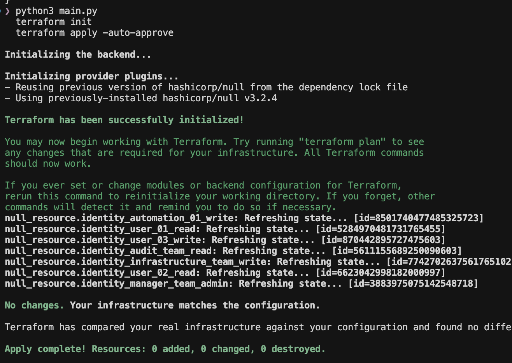
*Figura 5: Generación de archivos e inicialización del módulo Facade*

El script `main.py` generó exitosamente los tres archivos necesarios. Al inicializar Terraform, se descargó el proveedor `null` versión 3.2.4.

### Despliegue de la Infraestructura

Se procedió a aplicar la configuración generada.

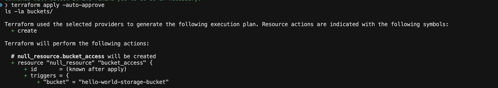
*Figura 6: Creación del bucket y configuración de acceso*

Durante la ejecución se observó cómo Terraform:
1. Creó el recurso `null_resource.storage_bucket`
2. Ejecutó el provisioner que creó físicamente el directorio `buckets/hello-world-storage-bucket`
3. Creó el recurso `null_resource.bucket_access` que depende del bucket

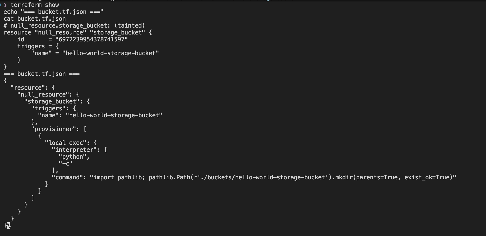
*Figura 7: Estado final mostrando bucket creado y mensaje de acceso aplicado*

Se verificó que el directorio del bucket fue creado exitosamente en el sistema de archivos, y el mensaje "Acceso aplicado al bucket hello-world-storage-bucket" confirmó que el provisioner de acceso se ejecutó correctamente.

### Aprendizajes del Patrón Facade

Lo más importante que se aprendió fue:

- La fachada expone solo el **nombre del bucket** a través del método `outputs()`. Los detalles de implementación (cómo se crea el directorio, dónde se almacena, etc.) quedan completamente ocultos.

- El módulo de acceso no necesita conocer cómo se implementa el bucket internamente. Solo consume la interfaz simple que provee la fachada.

- Se puede modificar completamente la implementación interna (por ejemplo, usar otro método para crear directorios) sin afectar el código que usa la fachada.

---

## Módulo 3: Implementación del Patrón Inversión de Control

### Contexto del Problema

El tercer patrón fue **Inversión de Control (IoC)**. La pregunta que se buscó responder: ¿cómo hacer que un módulo publique información que otros puedan consumir sin crear dependencias directas?

Tradicionalmente, si un servidor necesita información de la red, tendría que conocer directamente dónde está y cómo acceder a ella. Con IoC, se invierte este control: la red publica su información de manera independiente, y el servidor la consume cuando la necesita.

### Proceso de Implementación

Se utilizó el Makefile provisto para gestionar la ejecución secuencial de los módulos.

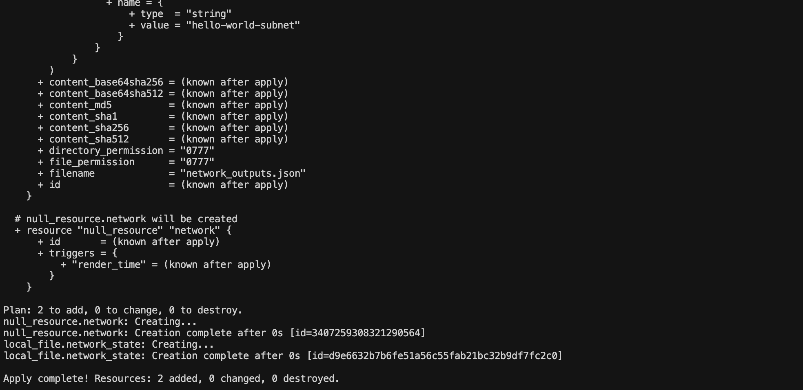
*Figura 8: Creación de la red con publicación de outputs*

Se ejecutó `make network`, que:
1. Inicializó Terraform en el directorio de red
2. Aplicó la configuración creando dos recursos:
   - `null_resource.network` - representa la red local
   - `local_file.network_state` - genera el archivo `network_outputs.json`

El archivo `network_outputs.json` actúa como un contrato de publicación. Contiene la información que la red hace disponible para otros módulos:
```json
{
  "outputs": {
    "cidr": {"type":"string", "value":"10.0.0.0/16"},
    "name": {"type":"string", "value":"hello-world-subnet"}
  }
}
```

### Generación del Módulo Servidor

Con la red ya desplegada y su información publicada, se procedió a generar el servidor.

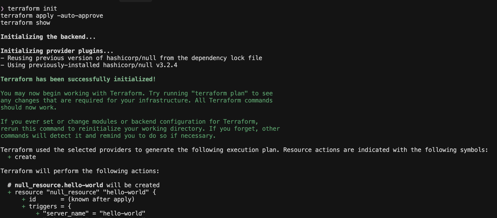
*Figura 9: Script Python leyendo outputs de red y generando configuración del servidor*

El script Python `main.py`:
1. Leyó el archivo `network_outputs.json` publicado por el módulo de red
2. Extrajo el nombre de la subred y el CIDR
3. Generó el archivo `main.tf.json` con la configuración del servidor, inyectando estos valores como triggers

### Despliegue del Servidor

Finalmente, se aplicó la configuración del servidor.

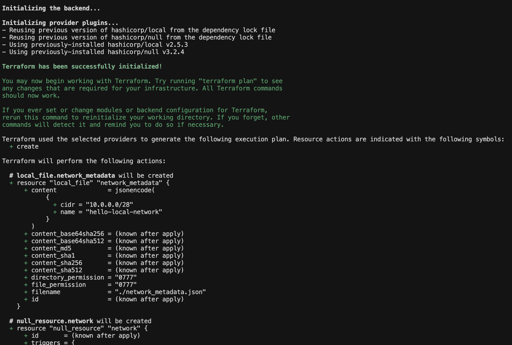
*Figura 10: Servidor creado consumiendo información publicada por la red*

El servidor se creó exitosamente con los siguientes triggers:
- `server_name`: hello-world
- `subnet_name`: hello-world-subnet (obtenido de la red)
- `subnet_cidr`: 10.0.0.0/16 (obtenido de la red)
- `zone`: local

### Aprendizajes del Patrón IoC

Los aprendizajes clave fueron:

- La red **no sabe** quién va a consumir su información. Simplemente la publica y está disponible para cualquiera que la necesite.

- El servidor **no controla** cómo se crea la red ni conoce sus detalles internos. Solo consume la información que la red pública.

- Si se cambian los valores de la red (nombre, CIDR), solo se necesita volver a ejecutar el script Python y aplicar. No hay que modificar el código.

- Esta inversión de control permite que los módulos evolucionen independientemente.

---

## Módulo 4: Implementación del Patrón Inyección de Dependencias

### Contexto del Problema

El cuarto patrón implementado fue **Inyección de Dependencias (DI)**. El problema planteado: ¿cómo proveer a un componente todo lo que necesita desde afuera, en lugar de que lo busque por sí mismo?

La diferencia con IoC es sutil pero importante: mientras IoC invierte quién controla el flujo, DI se enfoca en cómo se proveen las dependencias. En lugar de que el servidor busque la red, se le "inyectan" los datos de red cuando se crea.

### Proceso de Implementación - Módulo de Red

Se comenzó desplegando el módulo de red.

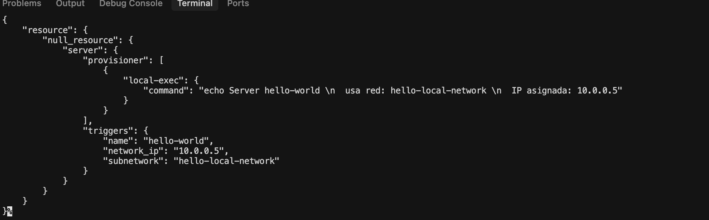
*Figura 11: Red generando archivo de metadatos para inyección*

La red se desplegó creando:
- `null_resource.network` con los triggers de configuración
- `local_file.network_metadata` que genera un archivo JSON simplificado

El archivo `network_metadata.json` contiene solo los datos esenciales:
```json
{"cidr":"10.0.0.0/28","name":"hello-local-network"}
```

Se observó que el CIDR es diferente al del módulo IoC (`/28` en lugar de `/16`), lo que permitirá demostrar cómo se calcula automáticamente la IP del servidor.

### Generación del Servidor con Dependencias Inyectadas

Se ejecutó el script Python que implementa la inyección de dependencias.

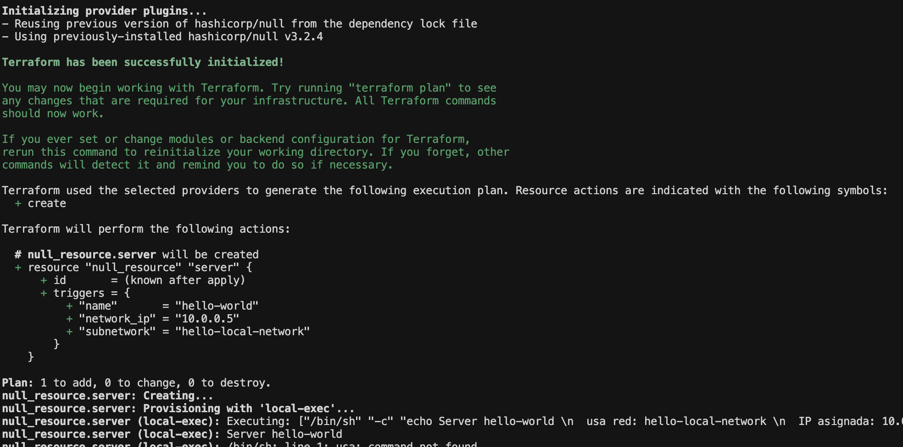
*Figura 12: Servidor generado con valores inyectados y cálculo automático de IP*

El script:
1. **Leyó** el archivo `network_metadata.json`
2. **Extrajo** el nombre de red y el CIDR
3. **Calculó** automáticamente la quinta dirección IP del rango
4. **Inyectó** todos estos valores en la configuración del servidor

Para un CIDR `/28`:
- Rango total: 10.0.0.0 - 10.0.0.15 (16 direcciones)
- Hosts utilizables: 10.0.0.1 - 10.0.0.14
- Quinta IP: **10.0.0.5**

### Despliegue del Servidor

Se aplicó la configuración del servidor con las dependencias inyectadas.

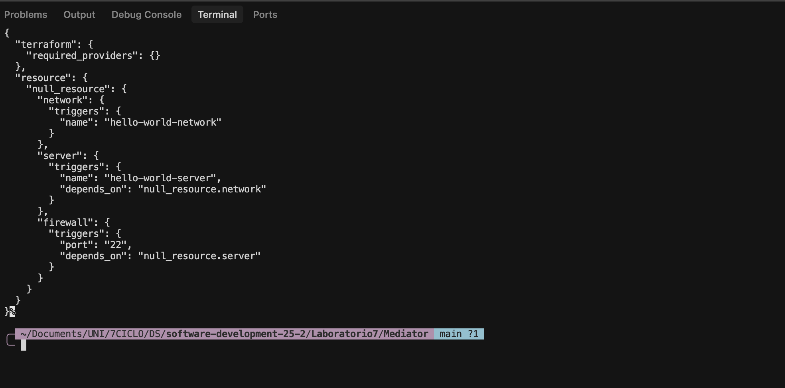
*Figura 13: Servidor desplegado mostrando IP calculada automáticamente*

El provisioner ejecutó el comando echo mostrando:
```
Server hello-world
  usa red: hello-local-network
  IP asignada: 10.0.0.5
```

El estado final confirmó que todos los valores fueron correctamente inyectados en los triggers del recurso.

### Aprendizajes del Patrón DI

Los aprendizajes principales fueron:

- El servidor **recibe** todas sus dependencias como parámetros. No tiene que buscar nada por sí mismo.

- Esto hace el código mucho más **fácil de probar**: se pueden inyectar valores de prueba sin necesidad de crear infraestructura real.

- El cálculo automático de la IP demuestra que se puede agregar lógica en la capa de inyección sin modificar el componente que recibe las dependencias.

- La separación entre "obtener dependencias" y "usar dependencias" hace el sistema más flexible y mantenible.

---

## Módulo 5: Implementación del Patrón Mediator

### Contexto del Problema

El último patrón implementado fue **Mediator**. El desafío: ¿cómo coordinar múltiples componentes que dependen unos de otros sin que se conozcan directamente?

Cuando se tienen componentes interdependientes (red → servidor → firewall), cada uno podría tener que conocer a los demás. El Mediator centraliza esta coordinación: todos los componentes hablan solo con el mediador, no entre ellos.

### Proceso de Implementación

Se ejecutó el script Python que implementa el patrón mediador.

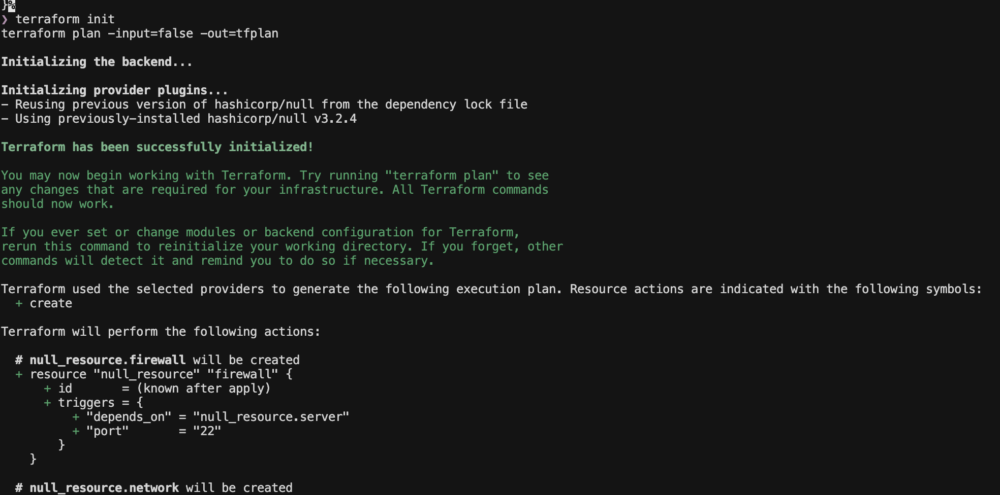
*Figura 14: Configuración generada mostrando la cadena de dependencias*

El mediador generó un archivo `main.tf.json` que muestra claramente la cadena de dependencias:

```json
{
  "resource": {
    "null_resource": {
      "network": {
        "triggers": {"name": "hello-world-network"}
      },
      "server": {
        "triggers": {
          "name": "hello-world-server",
          "depends_on": "null_resource.network"
        }
      },
      "firewall": {
        "triggers": {
          "port": "22",
          "depends_on": "null_resource.server"
        }
      }
    }
  }
}
```

Se observó que el mediador estableció correctamente la secuencia: network → server → firewall.

### Planificación y Despliegue

Se procedió a planificar y aplicar la configuración generada.

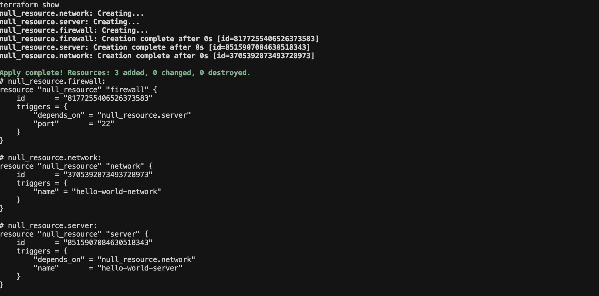
*Figura 15: Plan mostrando los 3 recursos a crear con sus dependencias*

El plan de Terraform mostró que se crearían 3 recursos. Aunque Terraform puede crearlos en paralelo (porque son `null_resource` sin provisioners), las dependencias en los triggers aseguran que el orden conceptual se mantiene.

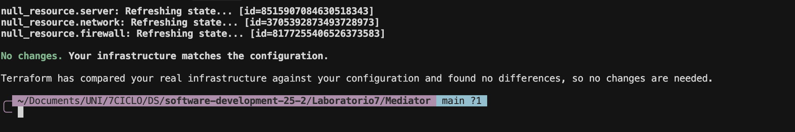
*Figura 16: Los 3 componentes creados exitosamente*

Los tres recursos se crearon instantáneamente:
- `null_resource.network` - ID: 3993461786567300954
- `null_resource.server` - ID: 1982409394061689153 (depende de network)
- `null_resource.firewall` - ID: 3523839030409747095 (depende de server)

### Verificación de Idempotencia

Un aspecto crucial de cualquier sistema IaC es la idempotencia. Se verificó ejecutando `terraform plan` por segunda vez, lo que confirmó **"No changes"**. Esto demuestra que ejecutar la misma operación múltiples veces produce el mismo resultado, una propiedad fundamental en infraestructura.

### Aprendizajes del Patrón Mediator

Los principales aprendizajes fueron:

- El mediador **coordina** sin que los módulos se conozcan entre sí. La red no sabe del servidor, el servidor no sabe del firewall.

- Todos los módulos solo conocen al mediador, lo que reduce dramáticamente el acoplamiento.

- Es muy fácil **agregar nuevos componentes**. Por ejemplo, si se quisiera agregar un load balancer, solo se añadiría al mediador sin tocar los otros módulos.

- La lógica de orquestación está centralizada en un solo lugar, lo que facilita el mantenimiento.

- **Idempotencia garantizada**: Terraform asegura que aplicar la misma configuración múltiples veces no causa efectos adversos.

---

## Análisis Comparativo de los Patrones

Después de implementar los cinco patrones, se realizó un análisis comparativo para entender cuándo usar cada uno:

| Patrón | Se usa cuando... | Beneficio Principal |
|--------|------------------|---------------------|
| **Adapter** | Necesitas que dos sistemas con interfaces incompatibles trabajen juntos | Permite integración sin modificar los sistemas existentes |
| **Facade** | Tienes un sistema complejo que quieres simplificar para los usuarios | Reduce la curva de aprendizaje y oculta complejidad |
| **IoC** | Quieres que componentes publiquen información sin saber quién la usa | Módulos completamente independientes y desacoplados |
| **DI** | Necesitas control total sobre qué dependencias recibe un componente | Facilita testing y hace el código más predecible |
| **Mediator** | Tienes muchos componentes que necesitan coordinarse | Evita el acoplamiento directo entre múltiples componentes |

### Cuándo Combinar Patrones

Se identificó que estos patrones no son mutuamente excluyentes. Por ejemplo:

- Se puede usar **Adapter + Facade**: Adaptar varios sistemas y luego exponerlos detrás de una fachada simple.
- Se puede usar **IoC + DI**: Un módulo publica información (IoC) que otro consume mediante inyección (DI).
- Se puede usar **Mediator + Adapter**: El mediador coordina componentes que usan adapters para comunicarse.

---

## Conclusiones

### Aprendizajes Técnicos

A través de este laboratorio se comprendió que:

1. **Los patrones de diseño trascienden el código de aplicación**: Aplicar patrones clásicos como Adapter, Facade y Mediator a infraestructura como código demuestra que los principios de diseño son universales.

2. **Desacoplamiento es la clave del éxito en IaC**: Todos los patrones implementados buscan reducir las dependencias directas entre componentes, lo que hace el sistema más mantenible y evolutivo.

3. **Infraestructura como código es... código**: Se beneficia de las mismas prácticas que el desarrollo de software tradicional: modularización, abstracción, separación de responsabilidades.

4. **Idempotencia es fundamental**: En infraestructura, poder ejecutar operaciones múltiples veces sin efectos adversos no es opcional, es crítico. Todos los módulos implementados cumplen esta propiedad.

### Retos Superados

Durante la implementación se encontraron y resolvieron varios desafíos:

- **Compatibilidad Python/macOS**: Se descubrió que macOS requiere usar `python3` en lugar de `python`. Esto se corrigió en todos los scripts y Makefiles.

- **Manejo de comandos bash**: Se aprendió que comandos con caracteres especiales (paréntesis, newlines) requieren quoting apropiado para evitar errores de sintaxis.

- **Gestión de estado de Terraform**: Se comprendió la importancia de destruir recursos entre ejecuciones para mantener un entorno limpio y reproducible.

### Aplicaciones Prácticas

Los conocimientos adquiridos son directamente aplicables a:

- **Entornos multi-cloud**: Usar Adapter para abstraer diferencias entre proveedores (AWS, GCP, Azure).

- **Arquitecturas de microservicios**: Aplicar Mediator para coordinar la infraestructura de múltiples servicios interdependientes.

- **Pipelines CI/CD**: Implementar Inyección de Dependencias para manejar configuraciones específicas de cada ambiente (dev, staging, producción).

- **Módulos Terraform reutilizables**: Crear bibliotecas de infraestructura usando Facade para simplificar su uso.
