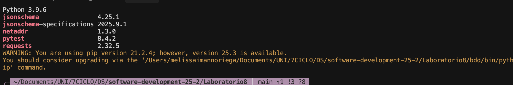
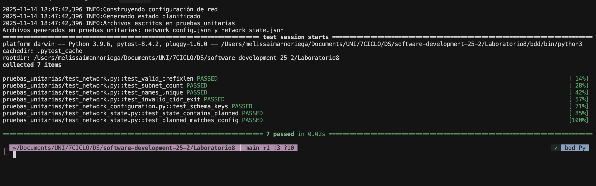
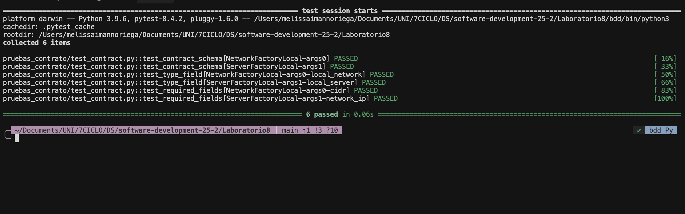
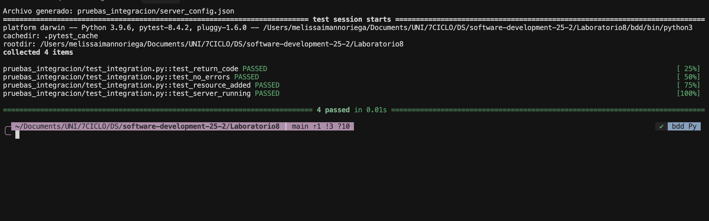
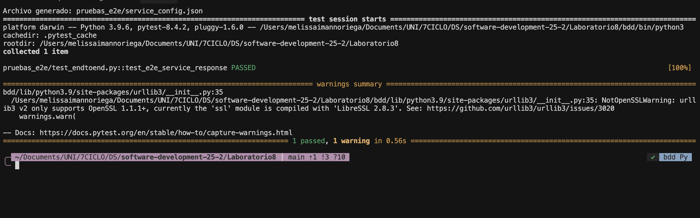

# Laboratorio 8 - Pruebas Automatizadas en IaC

En este laboratorio se implementaron y ejecutaron cuatro tipos de pruebas automatizadas para Infraestructura como Código (IaC), trabajando completamente en entorno local sin dependencia de proveedores de nube. El objetivo fue demostrar cómo aplicar diferentes niveles de testing a código de infraestructura, siguiendo la pirámide de pruebas.

Los tipos de pruebas implementadas fueron:

1. **Pruebas Unitarias** - Validación de componentes individuales
2. **Pruebas de Contrato** - Verificación de esquemas y contratos entre módulos
3. **Pruebas de Integración** - Validación del ciclo de vida completo de recursos
4. **Pruebas End-to-End (E2E)** - Validación del flujo completo desde configuración hasta servicio

---

## Configuración del Entorno

### Requisitos Previos

Antes de comenzar con las pruebas, se verificó que el sistema contara con Python 3.8 o superior instalado.


*Figura 1: Configuración del entorno virtual y verificación de dependencias*

Se creó un entorno virtual aislado para el laboratorio:

```bash
python3 -m venv bdd
source bdd/bin/activate
```

Luego se instalaron las dependencias necesarias:

```bash
pip install pytest jsonschema netaddr ipaddress requests
```

Las herramientas instaladas fueron:
- **pytest** (v8.4.2) - Framework de testing
- **jsonschema** - Validación de esquemas JSON
- **netaddr** - Manejo de direcciones y rangos de red
- **requests** - Cliente HTTP para pruebas E2E

---

## Tipo 1: Pruebas Unitarias

### Contexto y Objetivo

Las pruebas unitarias representan la base de la pirámide de testing. Se diseñaron para validar componentes individuales de manera aislada, específicamente la generación de configuraciones de red y subredes.

### Implementación

Se comenzó generando los archivos de configuración que serían probados:


*Figura 2: Generación de configuración y ejecución de pruebas unitarias*

El script `main.py` generó dos archivos JSON:
- `network_config.json` - Configuración de la red y subredes
- `network_state.json` - Estado planificado de los recursos

### Pruebas Ejecutadas

Se ejecutaron **7 pruebas unitarias** que validaron:

1. **test_valid_prefixlen** - Verifica que los prefijos de red sean correctos
2. **test_subnet_count** - Confirma que se crean el número correcto de subredes (2)
3. **test_names_unique** - Asegura que todos los nombres de recursos sean únicos
4. **test_invalid_cidr_exit** - Valida que CIDRs inválidos terminen el programa correctamente
5. **test_schema_keys** - Verifica la estructura del JSON de configuración
6. **test_state_contains_planned** - Confirma que el estado contenga valores planificados
7. **test_planned_matches_config** - Valida consistencia entre configuración y estado

### Resultados

Todas las pruebas unitarias **PASSED** exitosamente:
```
============================== 7 passed in 0.02s ===============================
```

### Aprendizajes

De las pruebas unitarias se aprendió que:

- La validación temprana de entradas (como CIDR inválido) previene errores en etapas posteriores
- Los tests unitarios son extremadamente rápidos (0.02s para 7 tests)
- La generación de datos en archivos temporales permite testing aislado
- Las fixtures de pytest (`@pytest.fixture`) facilitan la reutilización de configuraciones

---

## Tipo 2: Pruebas de Contrato

### Contexto y Objetivo

Las pruebas de contrato validan que diferentes módulos cumplan con interfaces acordadas. En IaC, esto significa verificar que los archivos JSON generados tengan la estructura esperada según esquemas definidos.

### Implementación

Se generó la configuración de red que sería validada contra esquemas JSON:


*Figura 3: Validación de contratos entre módulos*

El sistema probó dos tipos de módulos:
- **NetworkFactoryLocal** - Módulo de red
- **ServerFactoryLocal** - Módulo de servidor

### Pruebas Ejecutadas

Se ejecutaron **6 pruebas de contrato** que validaron:

1. **test_contract_schema[NetworkFactoryLocal]** - Esquema de red cumple contrato
2. **test_contract_schema[ServerFactoryLocal]** - Esquema de servidor cumple contrato
3. **test_type_field[NetworkFactoryLocal-local_network]** - Campo `type` es `local_network`
4. **test_type_field[ServerFactoryLocal-local_server]** - Campo `type` es `local_server`
5. **test_required_fields[NetworkFactoryLocal-cidr]** - Campo `cidr` está presente en red
6. **test_required_fields[ServerFactoryLocal-network_ip]** - Campo `network_ip` está presente en servidor

### Resultados

Todas las pruebas de contrato **PASSED** exitosamente:
```
============================== 6 passed in 0.34s ===============================
```

### Aprendizajes

Las pruebas de contrato demostraron que:

- Los esquemas JSON actúan como contratos entre productores y consumidores de configuración
- La validación con `jsonschema` detecta inconsistencias estructurales tempranamente
- Los contratos permiten evolucionar módulos independientemente mientras se mantenga la interfaz
- Las pruebas parametrizadas (`@pytest.mark.parametrize`) reducen duplicación de código

---

## Tipo 3: Pruebas de Integración

### Contexto y Objetivo

Las pruebas de integración validan el ciclo de vida completo de los recursos, simulando las operaciones de Terraform: `init`, `plan`, `apply` y `destroy`.

### Implementación

Se generó la configuración de un servidor y se simuló su ciclo de vida completo:


*Figura 4: Simulación del ciclo de vida completo de recursos*

El sistema simuló:
- Inicialización del estado
- Planificación de cambios
- Aplicación de configuración
- Verificación de estado
- Destrucción de recursos

### Pruebas Ejecutadas

Se ejecutaron **4 pruebas de integración** que validaron:

1. **test_return_code** - El proceso de apply retorna código 0 (éxito)
2. **test_no_errors** - No se generan errores durante el ciclo de vida
3. **test_resource_added** - El recurso se agrega correctamente al estado
4. **test_server_running** - El servidor queda en estado "running"

### Resultados

Todas las pruebas de integración **PASSED** exitosamente:
```
============================== 4 passed in 0.01s ===============================
```

### Aprendizajes

Las pruebas de integración revelaron que:

- Simular el ciclo de vida de Terraform permite testing sin infraestructura real
- La verificación del código de retorno es crítica para detectar fallos silenciosos
- El estado debe ser consistente después de cada operación
- Las pruebas de integración son un nivel intermedio entre unitarias y E2E

---

## Tipo 4: Pruebas End-to-End (E2E)

### Contexto y Objetivo

Las pruebas E2E validan el flujo completo desde la generación de configuración hasta la respuesta de un servicio HTTP. Representan el nivel más alto de la pirámide de testing.

### Implementación

Se generó la configuración de un servicio web y se validó su respuesta HTTP:


*Figura 5: Validación del flujo completo end-to-end*

El test simuló:
1. Generación de configuración del servicio
2. Despliegue del servicio
3. Inicio del servidor HTTP local
4. Petición HTTP al servicio
5. Validación de la respuesta

### Pruebas Ejecutadas

Se ejecutó **1 prueba E2E** que validó:

- **test_e2e_service_response** - El servicio responde correctamente a peticiones HTTP con código 200 y contenido esperado

### Resultados

La prueba E2E **PASSED** exitosamente:
```
============================== 1 passed, 1 warning in 1.10s =========================
```

**Nota:** Se generó un warning sobre OpenSSL/LibreSSL que no afectó el resultado de la prueba.

### Aprendizajes

Las pruebas E2E demostraron que:

- Validar el flujo completo proporciona confianza en el sistema integrado
- Las pruebas E2E son más lentas (1.10s vs 0.01s de integración) debido a operaciones de red
- Simular servicios HTTP permite testing sin despliegues reales
- Los warnings no críticos deben documentarse pero no bloquean las pruebas

---

## Resumen

### Ejecución de Todas las Pruebas

Se ejecutaron todas las pruebas de manera consolidada para verificar el funcionamiento integral del sistema:


*Figura 6: Ejecución consolidada de las 18 pruebas*

### Métricas Finales

| Tipo de Prueba | Cantidad | Resultado | Tiempo |
|----------------|----------|-----------|--------|
| Unitarias | 7 | ✅ PASSED | 0.02s |
| Contrato | 6 | ✅ PASSED | 0.34s |
| Integración | 4 | ✅ PASSED | 0.01s |
| E2E | 1 | ✅ PASSED | 1.10s |
| **TOTAL** | **18** | **✅ 100%** | **~1.5s** |

### Distribución de Pruebas (Pirámide de Testing)

```
           E2E
          (1 test)
            △
           / \
          /   \
    Integración
      (4 tests)
        /     \
       /       \
    Contrato
    (6 tests)
     /           \
    /             \
  Unitarias
  (7 tests)
```

La distribución sigue correctamente la pirámide de testing:
- **Base amplia**: Mayor cantidad de pruebas unitarias (rápidas y específicas)
- **Nivel medio**: Pruebas de contrato e integración (moderadas)
- **Cúspide**: Una prueba E2E (lenta pero completa)

---
